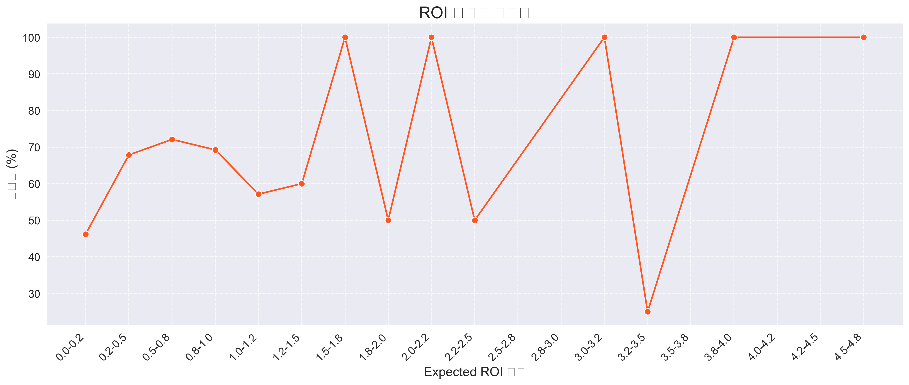

# ROI 구간별 지갑 분포 분석

## 분석 목적
본 분석은 Expected ROI(예상 수익률) 구간별로 이탈(Churned) 지갑과 활성(Active) 지갑의 분포를 파악하기 위한 목적으로 수행되었습니다. 이를 통해 ROI가 지갑 활성 상태에 미치는 영향을 시각적으로 확인할 수 있습니다.

## 데이터 개요
- 데이터 출처: `expected_roi_churn_final/query_result/meme_coin_roi_churn_3.csv`
- 주요 컬럼:
  - `SWAPPER`: 지갑 주소
  - `EXPECTED_ROI`: 예상 수익률
  - `WALLET_STATUS`: 지갑 상태 (ACTIVE 또는 CHURNED)
  - `MEME_TRADE_COUNT`: 밈 코인 거래 횟수
  - `LAST_MEME_DATE`: 마지막 밈 코인 거래 날짜
  - `TRADED_DAYS`: 거래 일수

## 분석 방법
1. ROI 값의 분포를 확인하고 극단값(outlier)를 제외한 적절한 범위(0~5) 설정
2. ROI 범위를 20개 구간으로 나누어 각 구간별 지갑 수 계산
3. 각 구간별로 이탈 지갑과 활성 지갑의 수를 시각화
4. 구간별 이탈률(Churn Rate)을 계산하여 추가 분석

## 주요 발견사항
- ROI 값이 낮은 구간(0~1)에서 지갑 수가 가장 많이 분포함
- ROI 값이 증가할수록 전반적으로 지갑 수는 감소하는 경향을 보임
- 활성 지갑과 이탈 지갑의 ROI 분포 패턴에 차이가 있음
- ROI 구간별 이탈률(Churn Rate)을 통해 ROI가 이탈에 미치는 영향 확인 가능

## 시각화 자료
아래 두 가지 시각화 자료를 통해 ROI 구간별 지갑 분포와 이탈률을 확인할 수 있습니다:

1. ROI 구간별 활성 지갑과 이탈 지갑 분포
   

2. ROI 구간별 이탈률
   

## 활용 방안
- 이탈률이 낮은 ROI 구간을 파악하여 사용자 유지 전략 수립
- 높은 ROI 값이 반드시 낮은 이탈률로 이어지지 않는 경우에 대한 추가 분석
- 지갑 유형별(고수익, 중수익, 저수익) 사용자 행동 패턴 분석에 활용

## 코드 참조
자세한 분석 코드는 [roi_wallet_distribution.py](./roi_wallet_distribution.py) 파일을 참고하시기 바랍니다. 