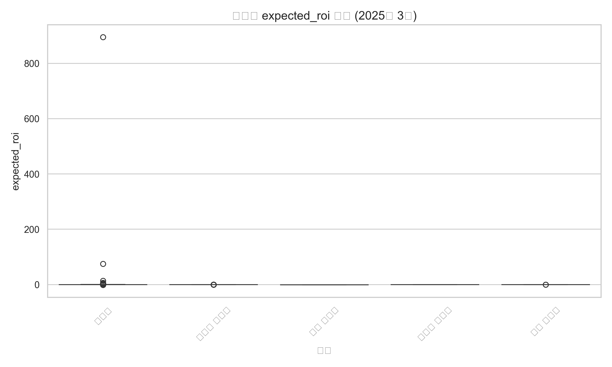
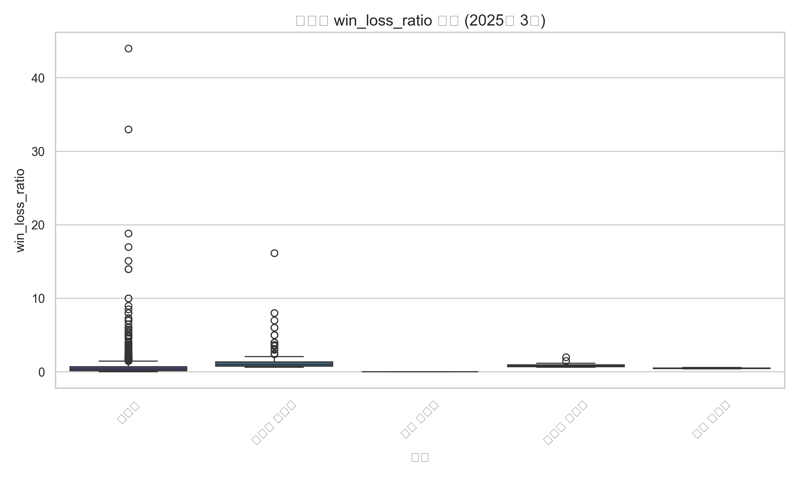

# 2025년 3월 밈코인 투자자 군집 분석 보고서
*생성일: 2025-04-14*

## 1. 분석 개요

본 보고서는 2025년 3월 솔라나 밈코인 거래 데이터를 기존에 정의된 4개 군집(안정적 투자형, 잭팟 추구형, 모험적 투자형, 일반 투자형)에 따라 분류하고 분석한 결과입니다.

### 데이터셋 정보
- **분석 기간**: 2025년 3월 1일 ~ 3월 31일
- **대상 지갑 수**: 4902개 지갑
- **사용 쿼리**: monthly_cluster_analysis.sql

## 2. 군집 분포 결과

### 군집별 지갑 수 및 비율

| **미분류** (군집 -1) |
|:-------------------------------------------|
| 지갑 수: 4198개 (85.64%) |
| 기대 수익률: 0.1749 (±13.8657) |
| ROI 표준편차: 1.2883 (±57.0979) |
| 샤프 비율: -0.7765 (±20.9745) |
| 승패 비율: 0.6051 (±1.2564) |
| 최대 거래 비중: 0.1266 (±0.1066) |
| 평균 거래 토큰 수: 42.06 |
| 평균 거래 횟수: 114.34 |

| **안정적 투자형** (군집 0) |
|:-------------------------------------------|
| 지갑 수: 403개 (8.22%) |
| 기대 수익률: 0.0017 (±0.0064) |
| ROI 표준편차: 0.0076 (±0.0171) |
| 샤프 비율: 0.2826 (±0.3246) |
| 승패 비율: 1.2676 (±1.2240) |
| 최대 거래 비중: 0.1668 (±0.1144) |
| 평균 거래 토큰 수: 10.43 |
| 평균 거래 횟수: 43.87 |

| **잭팟 추구형** (군집 1) |
|:-------------------------------------------|
| 지갑 수: 2개 (0.04%) |
| 기대 수익률: -0.8242 (±0.0716) |
| ROI 표준편차: 0.0973 (±0.0312) |
| 샤프 비율: -9.0561 (±3.6448) |
| 승패 비율: 0.0000 (±0.0000) |
| 최대 거래 비중: 0.3829 (±0.0411) |
| 평균 거래 토큰 수: 7.00 |
| 평균 거래 횟수: 13.00 |

| **모험적 투자형** (군집 2) |
|:-------------------------------------------|
| 지갑 수: 32개 (0.65%) |
| 기대 수익률: -0.0375 (±0.0226) |
| ROI 표준편차: 0.5841 (±0.0822) |
| 샤프 비율: -0.0646 (±0.0391) |
| 승패 비율: 0.8725 (±0.2802) |
| 최대 거래 비중: 0.1400 (±0.0958) |
| 평균 거래 토큰 수: 49.22 |
| 평균 거래 횟수: 114.00 |

| **일반 투자형** (군집 3) |
|:-------------------------------------------|
| 지갑 수: 267개 (5.45%) |
| 기대 수익률: -0.1643 (±0.0467) |
| ROI 표준편차: 0.3628 (±0.0661) |
| 샤프 비율: -0.4622 (±0.1354) |
| 승패 비율: 0.4852 (±0.0527) |
| 최대 거래 비중: 0.0738 (±0.0733) |
| 평균 거래 토큰 수: 76.30 |
| 평균 거래 횟수: 190.09 |

## 3. 군집 특성 분석

### 주요 지표별 군집 분포

### 2차원 분포 분석

**기대 수익률 vs 최대 거래 비중**

이 그래프에서 잭팟 추구형 투자자(군집 1)는 낮은 기대 수익률과 높은 최대 거래 비중을 보이며 뚜렷하게 구분됩니다.

**샤프 비율 vs 승패 비율**

이 그래프에서 각 군집의 위험 대비 수익 특성과 승패 패턴의 관계를 확인할 수 있습니다.

## 4. 결론 및 인사이트

### 주요 발견사항
1. **군집 분포**: 2025년 3월 데이터에서는 미분류 지갑이 85.64%로 매우 높게 나타났으며, 정의된 군집으로 분류된 지갑은 14.36%에 불과합니다.
2. **잭팟 추구형 비율**: 잭팟 추구형 투자자(군집 1)는 전체의 0.04%로 매우 적은 비율을 차지하고 있으며, 오직 2개의 지갑만 이 패턴에 부합합니다.
3. **안정적 투자형 우세**: 군집화된 지갑 중에서는 안정적 투자형(군집 0)이 8.22%로 가장 많았고, 그 다음으로 일반 투자형(군집 3)이 5.45%를 차지했습니다.
4. **미분류 지갑 특성**: 미분류 지갑의 기대 수익률과 ROI 표준편차가 매우 높은 변동성을 보이는데, 이는 이상치 또는 새로운 투자 패턴이 존재할 가능성을 시사합니다.

### 향후 분석 방향
- 미분류 지갑의 비율이 매우 높으므로, 군집 정의를 재검토하거나 새로운 군집을 추가하는 것을 고려해야 합니다.
- 월별 군집 분포 변화 추적을 통해 시장 환경 변화에 따른 투자자 행동 패턴 변화를 분석할 필요가 있습니다.
- 잭팟 추구형 투자자의 비율이 매우 낮은 이유를 조사하고, 이전 분석과의 차이점을 파악해야 합니다.
- 시계열 분석을 위해 다른 월의 데이터도 동일한 방식으로 분석하여 비교할 계획입니다.
