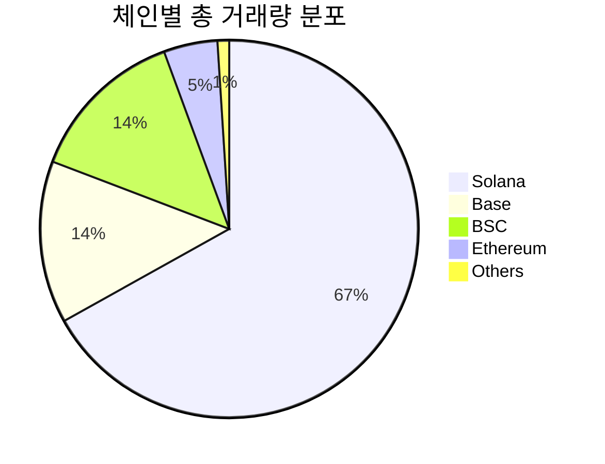
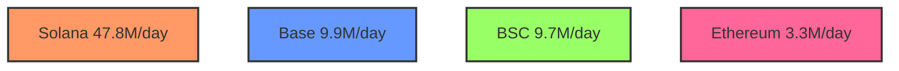
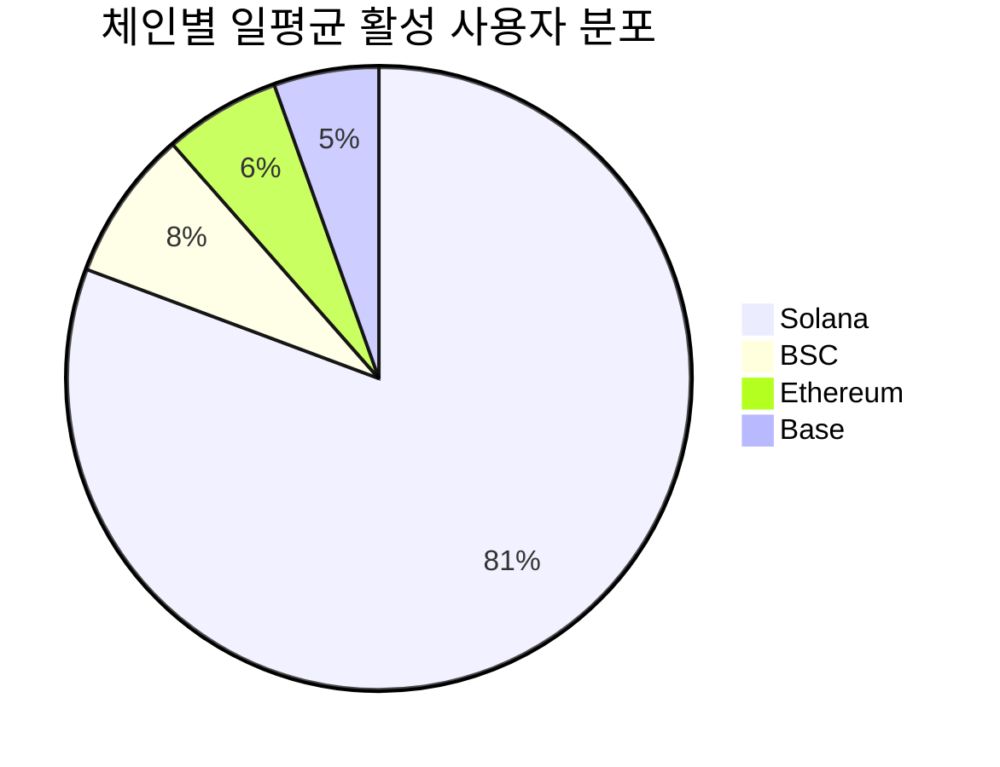

# 체인별 밈 코인 트레이딩 차트 분석

## 1. 거래량 분포


## 2. 일일 거래량 추이


## 3. 체인별 수익률 비교
```mermaid
bar title 체인별 수익률(%)
    Solana : 0.459
    Base : 0.240
    BSC : 0.232
    Ethereum : 0.223
```

## 4. 사용자 활성도


## 5. 거래 효율성 지표
```mermaid
bar title 거래당 평균 금액($)
    Avalanche : 894
    Base : 343
    Ethereum : 325
    BSC : 308
    Solana : 114
```

## 6. 시계열 특징
- 최대 일일 거래량:
  * Solana: 109.5M (3/7)
  * Base: 74.2M (3/8)
  * BSC: 52.9M (3/21)

- 최소 일일 거래량:
  * Solana: 15.9M (3/30)
  * Base: 2.7M (3/30)
  * BSC: 588K (3/12) 