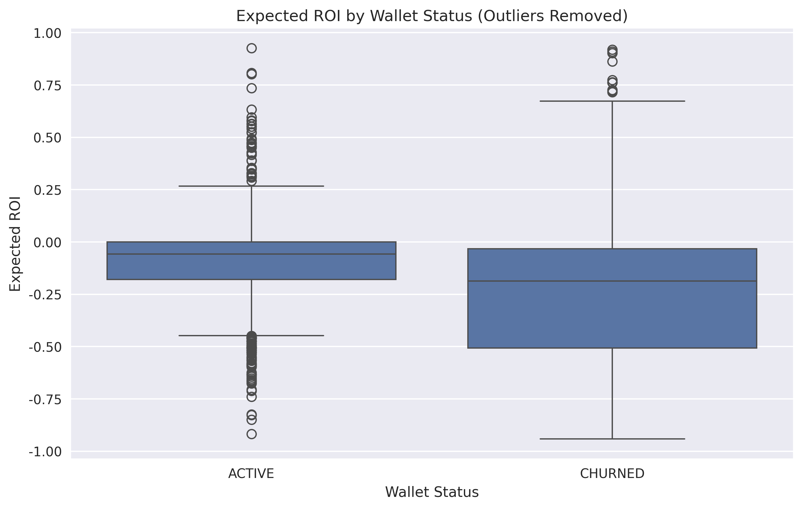
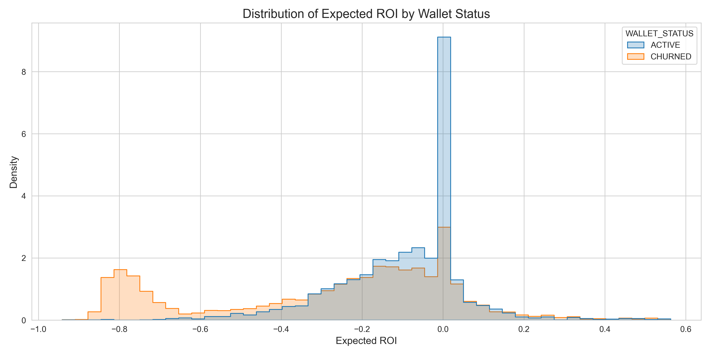
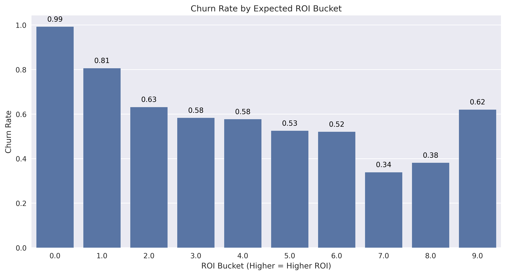
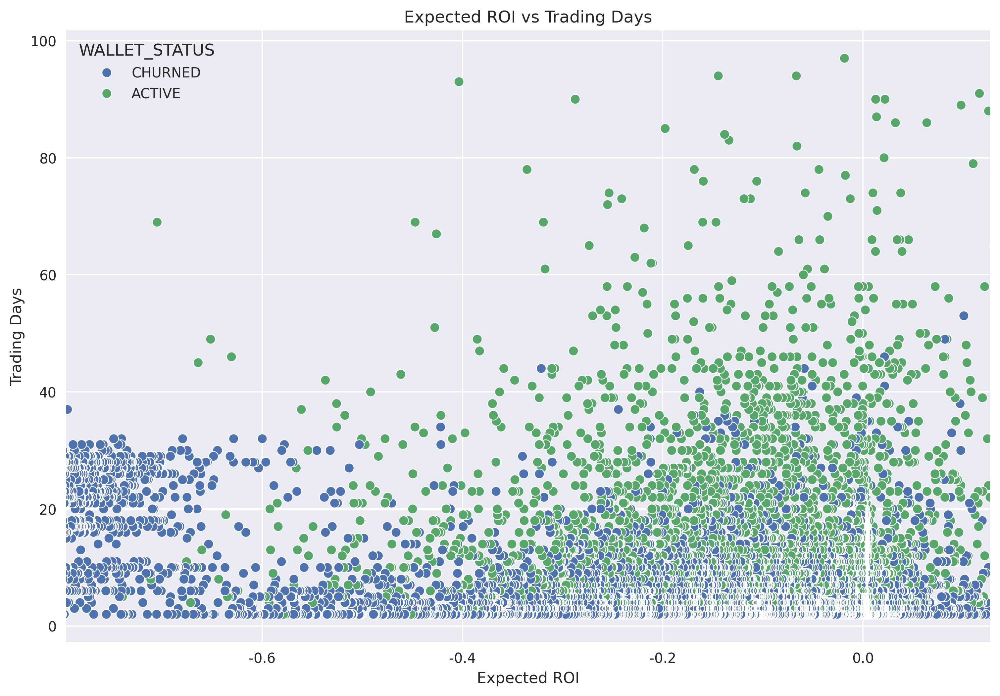
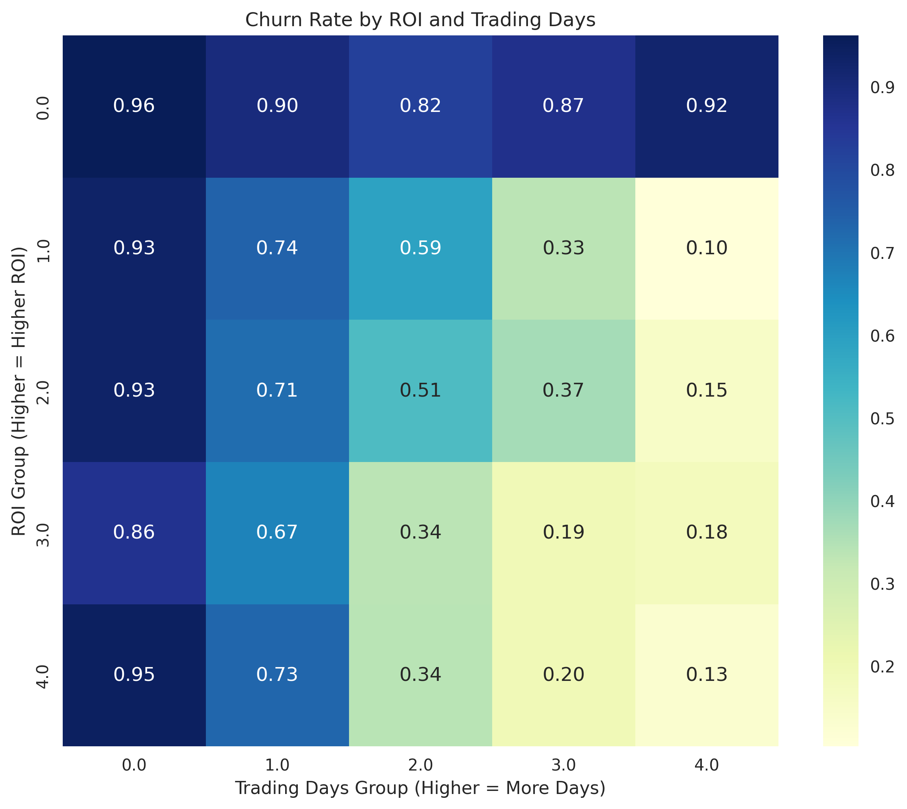

# Meme Coin Expected ROI and Churn Rate Analysis Report

## 1. Overview
- Total wallets analyzed: 7515
- Active wallets: 3017 (40.15%)
- Churned wallets: 4497 (59.84%)
- Overall churn rate: 59.84%

## 2. Analysis Results and Visualizations

### 2.1 Relationship Between Expected ROI and Churn

- Average expected ROI for active wallets: -0.06
- Average expected ROI for churned wallets: -0.17
- **Churned wallets have an expected ROI that is 0.11 lower on average than active wallets**

**Data Characteristics**: 
- Extreme outliers exist that could skew average values
- Even after outlier removal, the difference in expected ROI between the two groups persists
- 5-95% percentile range: [-0.80, 0.13] (range excluding extreme outliers)

**Boxplot Analysis**:
- [Original Boxplot](roi_by_status_boxplot_original.png): Includes all data, extreme outliers make distribution comparison difficult
- [Y-axis Limited Boxplot](roi_by_status_boxplot_ylim.png): Limited to 5-95% percentile range for better visualization of main distribution
- [Outlier Removed Boxplot](roi_by_status_boxplot.png): Statistical outliers removed to clearly show differences between groups

### 2.2 Expected ROI Distribution Analysis

- **Analysis Target**: Total 7,515 wallets (Active wallets: 3,017, 40.1%, Churned wallets: 4,497, 59.9%)
- **Expected ROI Distribution Summary**:
  - Active wallets average expected ROI: -0.06 (median: -0.06)
  - Churned wallets average expected ROI: -0.17 (median: -0.19)
  - Difference in expected ROI between groups: 0.11 (churned wallets are lower)
- **Distribution Shape**: Active wallets are concentrated around values close to 0, while churned wallets are more widely distributed in the negative region
- **Most Frequent Range**: 
  - Active wallets: Most concentrated in the -0.1~0.0 range
  - Churned wallets: Concentrated in the -0.3~-0.1 range
- **Quartile Comparison**:
  - Active wallets: 25% = -0.34, 50% = -0.06, 75% = 0.04
  - Churned wallets: 25% = -0.46, 50% = -0.19, 75% = -0.07
  - Churned wallets consistently show lower expected ROI across all quartiles

**Key Findings**:
- **Severe Loss Ratio**: The proportion of wallets with expected ROI < -0.5 shows a significant difference: 2.1% in the active group vs. 25.2% in the churned group
- **Statistical Significance**: Mann-Whitney U test results show that the distribution difference between the two groups is statistically very significant (p < 0.001)
- **Churn Predictive Power**: Expected ROI alone is a significant variable for predicting churn, with a correlation coefficient of -0.3202 indicating moderate predictive strength

**Interpretation Summary**: The expected ROI distributions of active and churned wallets show statistically significant differences, with wallets experiencing severe losses being much more likely to churn. Active wallets have an expected ROI distribution concentrated around 0, while churned wallets are more widely distributed in negative regions with lower means and medians.

### 2.3 Correlation Analysis Between Expected ROI and Churn

- **Point-Biserial Correlation Coefficient**: -0.3202 (p < 0.001)
  - This indicates a clear negative correlation between expected ROI and churn
  - In other words, higher expected ROI tends to be associated with lower probability of churn

- **t-test Results**: 
  - t-statistic: 32.7366
  - p-value: 0.0000
  - 95% confidence interval: [0.1699, 0.1915]
  - Statistically very significant results (p < 0.001), strongly supporting that there is a real difference in mean expected ROI between the two groups

- **Mann-Whitney U Test**:
  - U statistic: 8,967,731
  - p-value: < 0.0000000001
  - This indicates that the difference in expected ROI distribution between the two groups is statistically very significant

- **Logistic Regression Analysis**:
  - Expected ROI coefficient (β): -0.761411
  - Intercept: 0.495324
  - Odds Ratio: 0.467007
  - This means that for each 1-unit increase in expected ROI, the probability of churn decreases by approximately 53.3%
  - Model Performance: 
    - AUC: 0.6706 (moderate predictive power)
    - Accuracy: 63.34%
    - Precision: 66.14%, Recall: 76.71%
    - F1 Score: 0.7104

### 2.4 Expected ROI Bucket Analysis

- Buckets with highest churn rates: [0.0, 1.0, 2.0]
- Buckets with lowest churn rates: [7.0, 8.0, 6.0]
- **Lower expected ROI buckets (closer to 0) show higher churn rates, while higher buckets (6-8 range) show lower churn rates**
- **Expected ROI buckets divide expected returns into 10 equal-sized groups, with lower buckets representing lower expected ROI and higher buckets representing higher expected ROI**

**Anomaly**: In the highest expected ROI bucket (9.0), churn rate increases again. This can be interpreted in several ways:
1. **Profit Realization Effect**: Traders who achieved very high expected ROI may have realized their target profits and left the market
2. **Risk Aversion Behavior**: Traders who experienced extremely high returns may have left the market to avoid additional risk of loss
3. **Temporary Speculators**: Natural departure of temporary participants who achieved high returns in a short period
4. **Sample Size Issue**: The number of wallets in the highest expected ROI bucket may be small, leading to statistically unstable results

This phenomenon suggests that higher expected ROI does not always lead to lower churn rates, and further research is needed.

### 2.5 Relationship Between Trading Behavior and Expected ROI

- Wallets with more trading activity tend to have higher expected ROI
- Active wallets are generally distributed in areas with higher trading frequency

- Higher number of trading days correlates with higher likelihood of remaining active
- At the same expected ROI level, wallets with more trading days show lower churn rates
- Analysis shows a correlation coefficient of -0.0724 between expected ROI and trading days, indicating a weak negative correlation

- **Trading days have a stronger impact on churn rate than expected ROI**
- Despite low expected ROI, having more trading days significantly reduces the likelihood of churn
- The highest churn rate (96.6%) occurs in the group with the lowest ROI and fewest trading days
- The lowest churn rate (10.4%) occurs in the group with moderate ROI and the most trading days
- The effect of trading days on churn rate reduction is particularly pronounced in low ROI groups:
  - Group with fewest trading days: Average churn rate of 92.8%
  - Group with most trading days: Average churn rate of 40.7% (52.1%p decrease)

## 3. Implications
- Expected ROI appears to be a moderate predictor of churn (-0.3202)
- Traders with lower expected ROI are more likely to churn
- Logistic regression analysis results show that for each 1-unit increase in expected ROI, the probability of churn decreases by approximately 53.3% (odds ratio 0.467)
- The relationship between expected ROI and churn is strongly moderated by trading days
  - Heatmap analysis shows that within the same ROI group, churn rate decreases dramatically as trading days increase
  - Even in the lowest ROI group, users with the most trading days have a lower churn rate (92.7%) than those with the fewest trading days (96.6%)
  - The effect of trading days is most dramatic in the middle ROI range: churn rate of 93.3% for the lowest trading days group vs. 14.9% for the highest trading days group (78.4%p difference)
- **The correlation between expected ROI and trading days is weak (-0.0724), but the two variables act in a complementary manner for churn prediction**
- **Expected ROI alone is useful for predicting churn (AUC 0.6706), but combining it with trading days significantly enhances predictive accuracy**
- **Even with low expected ROI, high trading activity significantly reduces the likelihood of churn - this provides important implications for churn prevention strategies**

## 4. Recommendations
- Focus retention efforts on wallets with unknown expected ROI
- Consider the interaction between trading frequency and expected ROI when designing retention strategies
- Conduct further analysis to identify specific expected ROI thresholds that have the greatest impact on churn
- **Establish user segmentation strategies based on ROI-trading days heatmap**:
  - High-risk group (low ROI + low trading days): With 96.6% churn rate, this group requires intensive incentives or special promotions
  - Medium-risk group (moderate ROI + moderate trading days): With approximately 50% churn rate, this group needs customized educational content and trading activation incentives
  - Low-risk group (moderate ROI + high trading days): With 10.4% churn rate, this group should receive loyalty programs and access to premium features
- **Prioritize trading activity enhancement programs**: Heatmap analysis shows that trading days have a greater impact on churn rate than ROI, so incentive programs that promote trading activity should be prioritized
- **Differentiated strategies by trading day segments**:
  - Bottom 20% of trading days (2 days or fewer): Strengthen initial onboarding, provide simple trading guides, offer small trading bonuses
  - Middle range (5-16 days): Encourage continuous participation, weekly trading challenges, promote community engagement
  - Top 20% of trading days (28 days or more): VIP benefits, lower fees, exclusive investment opportunities
- **Develop separate retention strategies for users with low expected ROI (below -0.67)**: Provide educational content, risk management tools, and opportunities for small rewarded trades
- **High profit realization user management strategy**: Consider offering special benefits or advanced features to prevent users who have achieved very high expected ROI from leaving the platform
- **Enhance churn prediction models**: Develop multivariate churn prediction models using both expected ROI and trading days, enabling more accurate identification of at-risk groups and proactive responses

## 5. Methodology
The following methods were used in this analysis:
- Descriptive statistics to understand basic relationships
- **Logistic Regression Analysis**: A statistical method for modeling the probability of churn based on expected ROI. Predicts binary outcomes (active/churned), with coefficient β = -0.761411, odds ratio = 0.467, AUC = 0.6706
- Stratified analysis to examine the interaction between expected ROI and trading behavior
- **Point-Biserial Correlation Coefficient**: Measures correlation between a binary variable (churn status) and a continuous variable (expected ROI)
- **Mann-Whitney U Test**: A non-parametric method to verify distribution differences between groups (U statistic: 8,967,731, p < 0.0000000001)
- **Expected ROI Bucket Analysis**: Dividing expected returns into 10 segments and calculating churn rate for each segment
    
## 6. Conclusion: Verification of the Relationship Between Expected ROI and Churn
Results from testing the hypothesis that "lower expected ROI correlates with higher churn rates":

- **Hypothesis is partially supported**: On average, churned wallets have lower expected ROI (-0.17) than active wallets (-0.06)
- **Statistical significance**: Mann-Whitney U test (U statistic: 8,967,731, p < 0.0000000001) shows that the difference in expected ROI distributions between the two groups is statistically very significant
- **t-test significance**: t-test results with t-statistic 32.7366, p-value 0.0000, indicating that the difference in mean expected ROI between the two groups is statistically very significant
- **Logistic regression analysis results**: 
  - Expected ROI coefficient (β): -0.761411, odds ratio: 0.467007
  - This means that for each 1-unit increase in expected ROI, the probability of churn decreases by approximately 53.3%
  - Model accuracy 63.34%, AUC 0.6706, indicating moderate predictive power
- **Correlation strength**: The correlation between expected ROI and churn is moderate (-0.3202)
  - After outlier removal, the calculated correlation coefficient is -0.3202, indicating a substantively meaningful relationship between expected ROI and churn
  - This suggests that expected ROI can be a useful variable for predicting churn
- **Additional findings from heatmap analysis**:
  - Expected ROI and trading days have a weak negative correlation (-0.0724) but act complementarily in churn prediction
  - Trading days have a stronger impact on churn rate than expected ROI: 52.1%p difference between the lowest trading days group (92.8% average churn) and highest trading days group (40.7% average churn)
  - Variations in churn rate within ROI groups are pronounced based on trading days: the largest variation occurs in middle ROI groups (up to 78.4%p difference)
  - The lowest churn rate (10.4%) is observed in the group with moderate ROI and the highest number of trading days
- **Non-linear relationship between expected ROI and churn**: 
  - As expected ROI increases, churn rate generally decreases, but in the highest expected ROI bucket (9.0), churn rate increases again
  - This reflects various behavioral patterns of users who experienced extremely high expected ROI (profit realization followed by exit, risk aversion, etc.)
- **Importance of trading days as a moderating variable**: 
  - Trading days strongly moderate the relationship between expected ROI and churn
  - Even with low ROI, high trading activity significantly reduces the likelihood of churn
  - This suggests that user engagement and platform familiarity can mitigate the negative impact of low returns

In conclusion, this analysis demonstrates that a complex approach considering behavioral indicators such as trading activity alongside expected ROI is more effective for predicting and preventing churn than considering expected ROI alone. User retention strategies on trading platforms should focus not only on improving profitability but also on activities that increase engagement, particularly with a segmented approach based on ROI and trading days. Intensive interventions for high-risk groups (low ROI + low trading days) and incentives that promote trading activity can be effective strategies for preventing churn. 