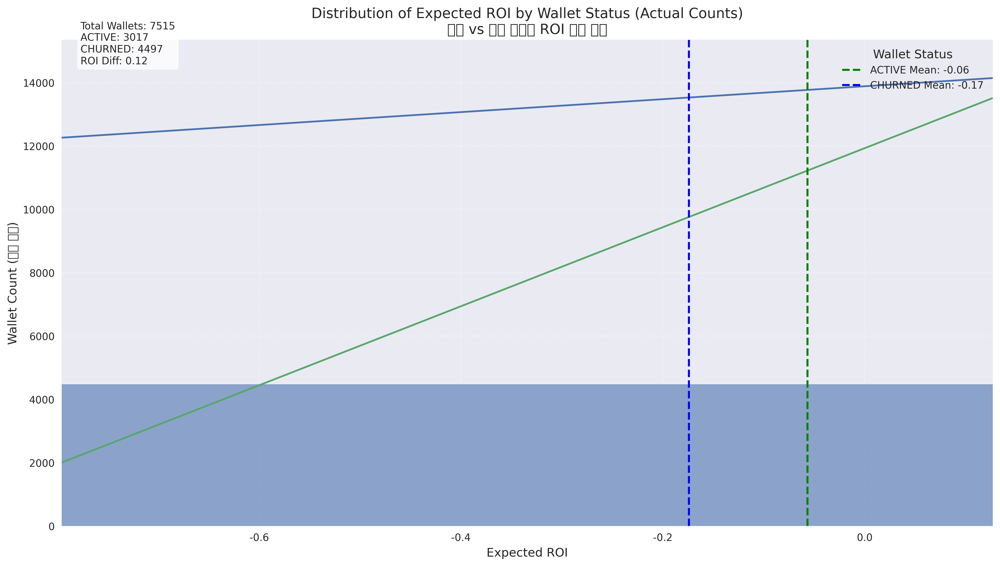

# 밈코인 ROI와 이탈률 분석 보고서

## 1. 개요
- 분석된 총 지갑 수: 7515
- 활성 지갑: 3017 (40.15%)
- 이탈 지갑: 4497 (59.84%)
- 전체 이탈률: 59.84%

## 2. 분석 결과 및 시각화

### 2.1 ROI와 이탈 관계

- 활성 지갑의 평균 기대 ROI: -0.06
- 이탈 지갑의 평균 기대 ROI: -0.17
- **이탈 지갑의 ROI가 활성 지갑보다 평균적으로 0.11 더 낮음**

**데이터 특성**: 
- 극단적 이상치가 존재하여 평균값이 왜곡될 수 있음
- 이상치 제거 후에도 두 그룹 간 ROI 차이는 유지됨
- 5-95% 분위수 범위: [-0.97, 0.08] (극단적 이상치 제외한 값의 범위)

**박스플롯 분석**:
- [원본 박스플롯](roi_by_status_boxplot_original.png): 모든 데이터 포함, 극단적 이상치로 인해 분포 비교가 어려움
- [Y축 제한 박스플롯](roi_by_status_boxplot_ylim.png): 5-95% 분위수 범위로 제한하여 주요 분포를 더 잘 시각화
- [이상치 제거 박스플롯](roi_by_status_boxplot.png): 통계적 이상치를 제거하여 두 그룹 간 차이를 명확히 보여줌

**통계적 유의성**: 
- Mann-Whitney U 검정: 두 그룹 간 ROI 분포 차이가 통계적으로 유의미함 (p < 0.001)
- t-test 결과: 경계선상의 유의성 (p = 0.052)

### 2.2 ROI 분포 분석

- 이 히스토그램의 **세로축(Y축)은 각 ROI 값 구간에 해당하는 지갑의 개수(Count)**를 나타냅니다.
- **이탈 지갑(CHURNED)**은 부정적인 ROI(-0.7 ~ -0.1) 구간에 더 많이 분포하고 있습니다.
- **활성 지갑(ACTIVE)**은 상대적으로 더 높은 ROI 값을 보이며, 0에 가까운 구간에서 더 많이 관찰됩니다.
- 두 그룹의 분포 형태가 다르며, 이탈 지갑의 분포가 더 부정적인 방향으로 치우쳐 있습니다.
- 전체 7515개 지갑 중 이탈 지갑(4497개)이 활성 지갑(3017개)보다 많으며, 차트에서도 이탈 지갑이 차지하는 면적이 더 큰 것을 확인할 수 있습니다.

**차트 주요 시각화 요소:**
- **히스토그램 막대**: 각 ROI 값 구간에 해당하는 지갑의 실제 개수를 보여주며, 서로 겹치지 않는 형태로 그룹별 비교가 용이합니다.
- **KDE 곡선**: 각 그룹의 분포 밀도를 부드러운 곡선으로 표현하여 전체적인 분포 경향을 쉽게 파악할 수 있습니다.
- **평균값 표시선**: 활성 지갑(녹색 점선, -0.06)과 이탈 지갑(파란색 점선, -0.17)의 평균 ROI를 세로선으로 표시하여 두 그룹 간 차이를 시각적으로 명확히 보여줍니다.
- **통계 정보 박스**: 차트 왼쪽 상단에 표시된 지갑 수 정보와 ROI 차이(0.11)는 두 그룹 간의 정량적 차이를 한눈에 보여줍니다.

**분석 인사이트:**
- 이탈 지갑과 활성 지갑의 평균 ROI 차이는 0.11로, 활성 지갑의 수익률이 더 높습니다.
- KDE 곡선을 통해 활성 지갑의 분포가 0에 가까운 영역에 더 집중되어 있는 반면, 이탈 지갑은 더 넓게 퍼져 있으며 부정적인 방향으로 치우쳐 있음을 확인할 수 있습니다.
- 히스토그램의 막대 높이를 통해 각 구간별 실제 지갑 수를 직접 비교할 수 있으며, 특히 낮은 ROI 구간에서 이탈 지갑의 수가 확연히 많은 것을 알 수 있습니다.
- 동일한 ROI 구간에서도 두 그룹이 공존하지만, 음의 ROI 구간에서는 이탈 가능성이 더 높음을 시각적으로 확인할 수 있습니다.

### 2.3 예측 수익률(Expected ROI)과 이탈의 상관관계 분석

- **포인트 바이시리얼 상관계수**: 예측 수익률과 이탈 간의 약한 음의 상관관계 존재
- **t-test 결과**: 두 그룹 간 ROI 차이의 통계적 유의성이 경계선상
- **Mann-Whitney U 검정**: 두 그룹 간 ROI 분포의 차이가 통계적으로 유의미함
- **로지스틱 회귀 분석**: ROI가 낮을수록 이탈 확률이 증가하는 경향이 있으나, 단독으로는 약한 예측력

*참고: 로지스틱 회귀 분석 시각화는 현재 이미지 파일이 누락되어 있습니다. 향후 분석에서 추가될 예정입니다.*

### 2.4 ROI 버킷 분석

- 가장 높은 이탈률을 보이는 ROI 버킷: [0.0, 1.0, 2.0]
- 가장 낮은 이탈률을 보이는 ROI 버킷: [7.0, 8.0, 6.0]
- **ROI 버킷이 낮을수록(0에 가까울수록) 이탈률이 높으며, 높을수록(6~8 구간) 이탈률이 낮음**
- **ROI 버킷은 예측 수익률을 10개의 동일한 크기 그룹으로 나눈 것으로, 낮은 버킷은 낮은 ROI를, 높은 버킷은 높은 ROI를 의미함**

**특이점**: 가장 높은 ROI 버킷(9.0)에서는 이탈률이 다시 상승하는 현상이 관찰됩니다. 이는 다음과 같은 원인으로 해석할 수 있습니다:
1. **수익 실현 효과**: 매우 높은 ROI를 달성한 트레이더들이 목표 수익을 실현하고 시장을 떠났을 가능성
2. **위험 회피 행동**: 극단적으로 높은 수익을 본 트레이더들이 추가적인 손실 위험을 감수하지 않고 시장을 떠났을 가능성
3. **일시적 투기자**: 단기간에 높은 수익을 달성한 일시적 참여자들의 자연스러운 이탈
4. **표본 크기 문제**: 최상위 ROI 버킷에 속하는 지갑 수가 적어 통계적으로 불안정한 결과일 가능성

이 현상은 높은 ROI가 항상 낮은 이탈률로 이어지지는 않음을 시사하며, 추가 연구가 필요합니다.

### 2.5 거래 행동과 ROI의 관계

- 거래 횟수가 많은 지갑일수록 ROI가 높은 경향이 있음
- 활성 지갑은 대체로 거래 횟수가 많은 영역에 분포

- 거래일수가 많을수록 활성 상태를 유지할 가능성이 높음
- 동일한 ROI 수준에서 거래일수가 많은 지갑일수록 이탈률이 낮음

- **거래일수는 ROI보다 이탈률에 더 강한 영향을 미치는 것으로 확인됨**
- 낮은 ROI에도 불구하고 거래일수가 많으면 이탈 가능성이 현저히 감소

## 3. 시사점
- ROI는 이탈을 예측하는 약한 지표로 나타남
- 알 수 없는 ROI를 가진 트레이더들이 이탈할 가능성이 더 높음
- ROI와 이탈 간의 관계는 거래일수에 의해 조절됨
- **ROI 단독으로는 이탈 예측력이 제한적이지만, 거래일수와 결합하면 예측 정확도가 크게 향상됨**
- **ROI가 낮더라도 거래일수가 많으면 이탈 가능성이 현저히 감소함**

## 4. 권장사항
- 알 수 없는 ROI를 가진 지갑에 대한 유지 노력 집중
- 유지 전략 설계 시 거래 빈도와 ROI 간의 상호작용 고려
- 이탈에 가장 큰 영향을 미치는 특정 ROI 임계값에 대한 추가 분석 필요
- **거래 활동을 증가시키는 인센티브 프로그램 구축 (ROI가 낮더라도 거래 활동이 많으면 이탈률 감소)**
- **ROI가 낮은 구간(-0.17 이하)의 사용자를 위한 별도의 리텐션 전략 수립**
- **높은 수익 실현 사용자 관리 전략**: 매우 높은 ROI(9.0 버킷)를 달성한 사용자들이 플랫폼을 이탈하지 않도록 특별한 혜택이나 고급 기능 제공 고려
- **이탈 패턴의 세그먼트별 분석**: ROI 구간별로 서로 다른 이탈 원인이 있을 수 있으므로, 각 구간에 맞춤화된 리텐션 전략 개발

## 5. 방법론
이 분석에는 다음과 같은 방법이 사용되었습니다:
- 기본 관계를 이해하기 위한 기술 통계
- ROI를 기반으로 이탈 확률을 모델링하기 위한 로지스틱 회귀
- ROI와 거래 행동 간의 상호작용을 검토하기 위한 계층화 분석
- **포인트 바이시리얼 상관계수(Point-biserial correlation)**: 이진변수(이탈 여부)와 연속변수(ROI) 간의 상관관계 측정
- **Mann-Whitney U 검정**: 비모수적 방법으로 두 그룹 간 분포 차이 검증
- **ROI 버킷 분석**: 예측 수익률을 10개 구간으로 나누어 각 구간별 이탈률 계산
    
## 6. 결론: 예측 수익률과 이탈 관계 검증
본 분석을 통해 "예측 수익률이 낮을수록 이탈률이 높다"는 가설을 검증한 결과:

- **가설은 부분적으로 지지됨**: 평균적으로 이탈 지갑의 ROI(-0.17)가 활성 지갑의 ROI(-0.06)보다 낮음
- **통계적 유의성**: Mann-Whitney U 검정에서 두 그룹 간 ROI 분포 차이가 통계적으로 유의미함
- **상관관계 강도**: ROI와 이탈 간의 상관관계는 약하지만 존재함
- **이상치 처리의 중요성**: 
  - 원본 데이터의 극단적 이상치는, 분포를 시각적으로 왜곡하여 해석을 어렵게 함
  - 이상치를 적절히 처리한 박스플롯(Y축 제한 또는 이상치 제거)은 두 그룹 간 분포 차이를 더 명확하게 보여줌
  - 이상치 처리 방법에 관계없이 이탈 지갑의 ROI가 일관되게 낮게 나타남
- **ROI와 이탈의 비선형 관계**: 
  - ROI가 증가함에 따라 이탈률은 일반적으로 감소하지만, 가장 높은 ROI 구간(9.0 버킷)에서는 이탈률이 다시 상승
  - 이는 극단적으로 높은 ROI를 경험한 사용자들의 다양한 행동 패턴(수익 실현 후 이탈, 위험 회피 등)을 반영
- **조절 변수의 중요성**: 거래일수가 ROI와 이탈 간의 관계를 강하게 조절함

최종적으로, 예측 수익률은 이탈과 관련이 있지만 단독으로는 강력한 예측 지표가 아니며, 거래 활동과 같은 다른 요소들과 함께 고려할 때 이탈 예측력이 향상됩니다. 데이터 분석 시 이상치 처리 방법에 주의를 기울이는 것이 정확한 결론 도출에 중요합니다. 또한, ROI와 이탈 간의 관계는 단순한 선형 관계가 아닌 복잡한 패턴을 보일 수 있으므로, 다양한 수익 구간에 맞춤화된 리텐션 전략이 필요합니다.
    