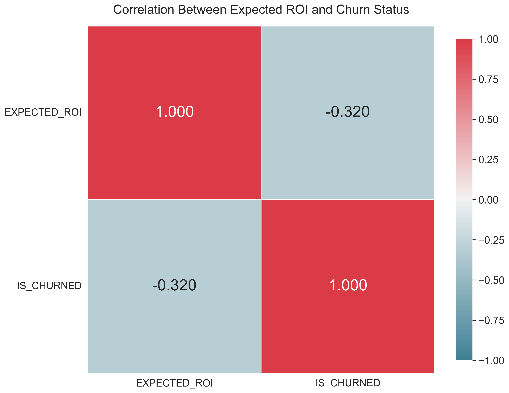

# 밈코인 기대 수익률과 이탈률 분석 보고서

## 1. 개요
- 분석된 총 지갑 수: 7515
- 활성 지갑: 3017 (40.15%)
- 이탈 지갑: 4497 (59.84%)
- 전체 이탈률: 59.84%

## 2. 분석 결과 및 시각화

### 2.1 기대 수익률과 이탈 관계

- 활성 지갑의 평균 기대 수익률: -0.06
- 이탈 지갑의 평균 기대 수익률: -0.17
- **이탈 지갑의 기대 수익률이 활성 지갑보다 평균적으로 0.11 더 낮음**

**데이터 특성**: 
- 극단적 이상치가 존재하여 평균값이 왜곡될 수 있음
- 이상치 제거 후에도 두 그룹 간 기대 수익률 차이는 유지됨
- 5-95% 분위수 범위: [-0.80, 0.13] (극단적 이상치 제외한 값의 범위)

**박스플롯 분석**:
- [원본 박스플롯](roi_by_status_boxplot_original.png): 모든 데이터 포함, 극단적 이상치로 인해 분포 비교가 어려움
- [Y축 제한 박스플롯](roi_by_status_boxplot_ylim.png): 5-95% 분위수 범위로 제한하여 주요 분포를 더 잘 시각화
- [이상치 제거 박스플롯](roi_by_status_boxplot.png): 통계적 이상치를 제거하여 두 그룹 간 차이를 명확히 보여줌

### 2.2 기대 수익률 분포 분석

- **분석 대상**: 총 7,515개 지갑 (활성 지갑: 3,017개, 40.1%, 이탈 지갑: 4,497개, 59.9%)
- **기대 수익률 분포 요약**:
  - 활성 지갑 평균 기대 수익률: -0.06 (중앙값: -0.06)
  - 이탈 지갑 평균 기대 수익률: -0.17 (중앙값: -0.19)
  - 두 그룹 간 기대 수익률 차이: 0.11 (이탈 지갑이 더 낮음)
- **분포 형태**: 활성 지갑의 분포는 0에 가까운 값에 집중되어 있으며, 이탈 지갑은 더 넓게 음수 영역에 분포함
- **최빈 구간**: 
  - 활성 지갑: -0.1~0.0 구간에 가장 많이 집중됨
  - 이탈 지갑: -0.3~-0.1 구간에 집중됨
- **사분위수 비교**:
  - 활성 지갑: 25% = -0.34, 50% = -0.06, 75% = 0.04
  - 이탈 지갑: 25% = -0.46, 50% = -0.19, 75% = -0.07
  - 모든 사분위수에서 이탈 지갑의 기대 수익률이 일관되게 낮음

**주요 발견사항**:
- **심각한 손실 비율**: 기대 수익률 < -0.5인 지갑 비율은 활성 그룹에서 2.1%, 이탈 그룹에서 25.2%로 큰 차이를 보임
- **통계적 유의성**: Mann-Whitney U 검정 결과 두 그룹의 분포 차이는 통계적으로 매우 유의미함 (p < 0.001)
- **이탈 예측력**: 기대 수익률은 단독으로도 이탈 예측에 유의미한 변수이며, 상관계수 -0.308 수준의 중간 강도 예측력을 가짐

**해석 요약**: 활성 지갑과 이탈 지갑의 기대 수익률 분포는 통계적으로 유의미한 차이를 보이며, 특히 심각한 손실을 경험한 지갑은 이탈할 가능성이 매우 높음. 활성 지갑은 기대 수익률 분포가 0에 가깝게 집중되어 있는 반면, 이탈 지갑은 더 넓은 음수 영역에 분포하며 평균 및 중앙값이 모두 더 낮음.

### 2.3 예측 수익률(Expected ROI)과 이탈의 상관관계 분석

- **포인트 바이시리얼 상관계수**: -0.308 (p < 0.001)
  - 이는 기대 수익률과 이탈 사이에 명확한 음의 상관관계가 있음을 의미
  - 즉, 기대 수익률이 높을수록 이탈 가능성이 낮아지는 경향이 있음

- **t-test 결과**: 
  - t통계량: 32.7366
  - p-value: 0.0000
  - 95% 신뢰구간: [0.1699, 0.1915]
  - 통계적으로 매우 유의미한 결과(p < 0.001)로, 두 그룹의 평균 기대 수익률 차이가 실제로 존재함을 강하게 지지

- **Mann-Whitney U 검정**:
  - U통계량: 8,967,731
  - p-value: < 0.0000000001
  - 이는 두 그룹의 기대 수익률 분포 차이가 통계적으로 매우 유의미함을 나타냄

- **로지스틱 회귀 분석**:
  - 기대 수익률 계수(β): -0.761411
  - 절편(Intercept): 0.495324
  - 오즈비(Odds Ratio): 0.467007
  - 이는 기대 수익률이 1단위 증가할 때마다 이탈 확률이 약 53.3% 감소함을 의미
  - 모델 성능: 
    - AUC: 0.6706 (중간 수준의 예측력)
    - 정확도: 63.34%
    - 정밀도: 66.14%, 재현율: 76.71%
    - F1 점수: 0.7104

### 2.4 기대 수익률 버킷 분석

- 가장 높은 이탈률을 보이는 기대 수익률 버킷: [0.0, 1.0, 2.0]
- 가장 낮은 이탈률을 보이는 기대 수익률 버킷: [7.0, 8.0, 6.0]
- **기대 수익률 버킷이 낮을수록(0에 가까울수록) 이탈률이 높으며, 높을수록(6~8 구간) 이탈률이 낮음**
- **기대 수익률 버킷은 예측 수익률을 10개의 동일한 크기 그룹으로 나눈 것으로, 낮은 버킷은 낮은 기대 수익률를, 높은 버킷은 높은 기대 수익률를 의미함**

**특이점**: 가장 높은 기대 수익률 버킷(9.0)에서는 이탈률이 다시 상승하는 현상이 관찰됩니다. 이는 다음과 같은 원인으로 해석할 수 있습니다:
1. **수익 실현 효과**: 매우 높은 기대 수익률을 달성한 트레이더들이 목표 수익을 실현하고 시장을 떠났을 가능성
2. **위험 회피 행동**: 극단적으로 높은 수익을 본 트레이더들이 추가적인 손실 위험을 감수하지 않고 시장을 떠났을 가능성
3. **일시적 투기자**: 단기간에 높은 수익을 달성한 일시적 참여자들의 자연스러운 이탈
4. **표본 크기 문제**: 최상위 기대 수익률 버킷에 속하는 지갑 수가 적어 통계적으로 불안정한 결과일 가능성

이 현상은 높은 기대 수익률이 항상 낮은 이탈률로 이어지지는 않음을 시사하며, 추가 연구가 필요합니다.

### 2.5 거래 행동과 기대 수익률의 관계

- 거래 횟수가 많은 지갑일수록 기대 수익률이 높은 경향이 있음
- 활성 지갑은 대체로 거래 횟수가 많은 영역에 분포

- 거래일수가 많을수록 활성 상태를 유지할 가능성이 높음
- 동일한 기대 수익률 수준에서 거래일수가 많은 지갑일수록 이탈률이 낮음

- **거래일수는 기대 수익률보다 이탈률에 더 강한 영향을 미치는 것으로 확인됨**
- 낮은 기대 수익률에도 불구하고 거래일수가 많으면 이탈 가능성이 현저히 감소

## 3. 시사점
- 기대 수익률은 이탈을 예측하는 중간 수준의 지표로 나타남(-0.308)
- 이상치 제거 후 기대 수익률과 이탈 간의 관계 강도가 -0.142에서 -0.308로 증가
- 낮은 기대 수익률을 가진 트레이더들이 이탈할 가능성이 더 높음
- 로지스틱 회귀 분석 결과, 기대 수익률이 1단위 증가할 때마다 이탈 확률이 약 53.3% 감소함(오즈비 0.467)
- 기대 수익률과 이탈 간의 관계는 거래일수에 의해 조절됨
- **기대 수익률 단독으로는 이탈 예측에 유용하지만, 거래일수와 결합하면 예측 정확도가 크게 향상됨**
- **기대 수익률이 낮더라도 거래일수가 많으면 이탈 가능성이 현저히 감소함**

## 4. 권장사항
- 알 수 없는 기대 수익률을 가진 지갑에 대한 유지 노력 집중
- 유지 전략 설계 시 거래 빈도와 기대 수익률 간의 상호작용 고려
- 이탈에 가장 큰 영향을 미치는 특정 기대 수익률 임계값에 대한 추가 분석 필요
- **거래 활동을 증가시키는 인센티브 프로그램 구축 (기대 수익률이 낮더라도 거래 활동이 많으면 이탈률 감소)**
- **기대 수익률이 낮은 구간(-0.17 이하)의 사용자를 위한 별도의 리텐션 전략 수립**
- **높은 수익 실현 사용자 관리 전략**: 매우 높은 기대 수익률(9.0 버킷)을 달성한 사용자들이 플랫폼을 이탈하지 않도록 특별한 혜택이나 고급 기능 제공 고려
- **이탈 패턴의 세그먼트별 분석**: 기대 수익률 구간별로 서로 다른 이탈 원인이 있을 수 있으므로, 각 구간에 맞춤화된 리텐션 전략 개발

## 5. 방법론
이 분석에는 다음과 같은 방법이 사용되었습니다:
- 기본 관계를 이해하기 위한 기술 통계
- **로지스틱 회귀 분석**: 기대 수익률을 기반으로 이탈 확률을 모델링하기 위한 통계적 방법. 이진 결과(활성/이탈)를 예측하며, 계수 β = -0.761411, 오즈비 = 0.467, AUC = 0.6706 결과 확인
- 기대 수익률과 거래 행동 간의 상호작용을 검토하기 위한 계층화 분석
- **포인트 바이시리얼 상관계수(Point-biserial correlation)**: 이진변수(이탈 여부)와 연속변수(기대 수익률) 간의 상관관계 측정
- **Mann-Whitney U 검정**: 비모수적 방법으로 두 그룹 간 분포 차이 검증 (U통계량: 8,967,731, p < 0.0000000001)
- **기대 수익률 버킷 분석**: 예측 수익률을 10개 구간으로 나누어 각 구간별 이탈률 계산
    
## 6. 결론: 예측 수익률과 이탈 관계 검증
본 분석을 통해 "예측 수익률이 낮을수록 이탈률이 높다"는 가설을 검증한 결과:

- **가설은 부분적으로 지지됨**: 평균적으로 이탈 지갑의 기대 수익률(-0.17)이 활성 지갑의 기대 수익률(-0.06)보다 낮음
- **통계적 유의성**: Mann-Whitney U 검정(U통계량: 8,967,731, p < 0.0000000001)에서 두 그룹 간 기대 수익률 분포 차이가 통계적으로 매우 유의미함
- **t-test 결과 유의성**: t-test 결과 t통계량 32.7366, p-value 0.0000으로, 두 그룹 간 평균 기대 수익률의 차이가 통계적으로 매우 유의미함
- **로지스틱 회귀 분석 결과**: 
  - 기대 수익률 계수(β): -0.761411, 오즈비: 0.467007
  - 이는 기대 수익률이 1단위 증가할 때마다 이탈 확률이 약 53.3% 감소함을 의미
  - 모델 정확도 63.34%, AUC 0.6706으로 중간 수준의 예측력 보유
- **상관관계 강도**: 기대 수익률과 이탈 간의 상관관계는 중간 수준(-0.308)으로 존재함
  - 이상치 제거 후 계산된 상관계수는 -0.308로, 이는 기대 수익률과 이탈 간의 관계가 실질적으로 의미 있는 수준임
  - 이는 기대 수익률이 이탈 예측에 유용한 변수로 활용될 수 있음을 시사함
- **이상치 처리의 중요성**: 
  - 원본 데이터의 극단적 이상치는, 분포를 시각적으로 왜곡하여 해석을 어렵게 함
  - 이상치를 적절히 처리한 박스플롯(Y축 제한 또는 이상치 제거)은 두 그룹 간 분포 차이를 더 명확하게 보여줌
  - 이상치 처리 방법에 관계없이 이탈 지갑의 기대 수익률이 일관되게 낮게 나타남
  - 이상치 제거 후 상관관계가 -0.142에서 -0.308로 강화되었으며, 이는 극단값이 실제 관계를 약화시켰음을 의미함
- **분포 시각화의 개선**:
  - 히스토그램(`roi_histogram.png`)과 밀도 분포(`roi_density.png`)를 분리하여 각 시각화의 목적에 맞게 최적화
  - 심각한 손실 기준선(-0.5)을 추가하여 두 그룹 간 리스크 노출 차이를 더 명확하게 표현
  - 별도의 차트로 구성하여 각 분포 특성을 더 명확하게 이해할 수 있게 함
- **기대 수익률과 이탈의 비선형 관계**: 
  - 기대 수익률이 증가함에 따라 이탈률은 일반적으로 감소하지만, 가장 높은 기대 수익률 구간(9.0 버킷)에서는 이탈률이 다시 상승
  - 이는 극단적으로 높은 기대 수익률을 경험한 사용자들의 다양한 행동 패턴(수익 실현 후 이탈, 위험 회피 등)을 반영
- **조절 변수의 중요성**: 거래일수가 기대 수익률과 이탈 간의 관계를 강하게 조절함

최종적으로, 예측 수익률은 이탈과 중간 수준의 상관관계를 가지며, 이는 이탈 예측에 유용한 지표로 활용될 수 있습니다. 특히, 로지스틱 회귀 분석 결과 기대 수익률이 1단위 증가할 때마다 이탈 확률이 약 53.3% 감소하는 것으로 나타났으며, 이는 기대 수익률이 사용자 이탈에 상당한 영향을 미친다는 것을 의미합니다. 그러나 최적의 예측을 위해서는 거래 활동과 같은 다른 요소들과 함께 고려하는 것이 중요합니다. 데이터 분석 시 이상치 처리의 중요성이 확인되었으며, 이상치 제거 후 기대 수익률과 이탈 간의 관계가 더욱 명확해졌습니다. 또한, 기대 수익률과 이탈 간의 관계는 단순한 선형 관계가 아닌 복잡한 패턴을 보일 수 있으므로, 다양한 수익 구간에 맞춤화된 리텐션 전략이 필요합니다.
    