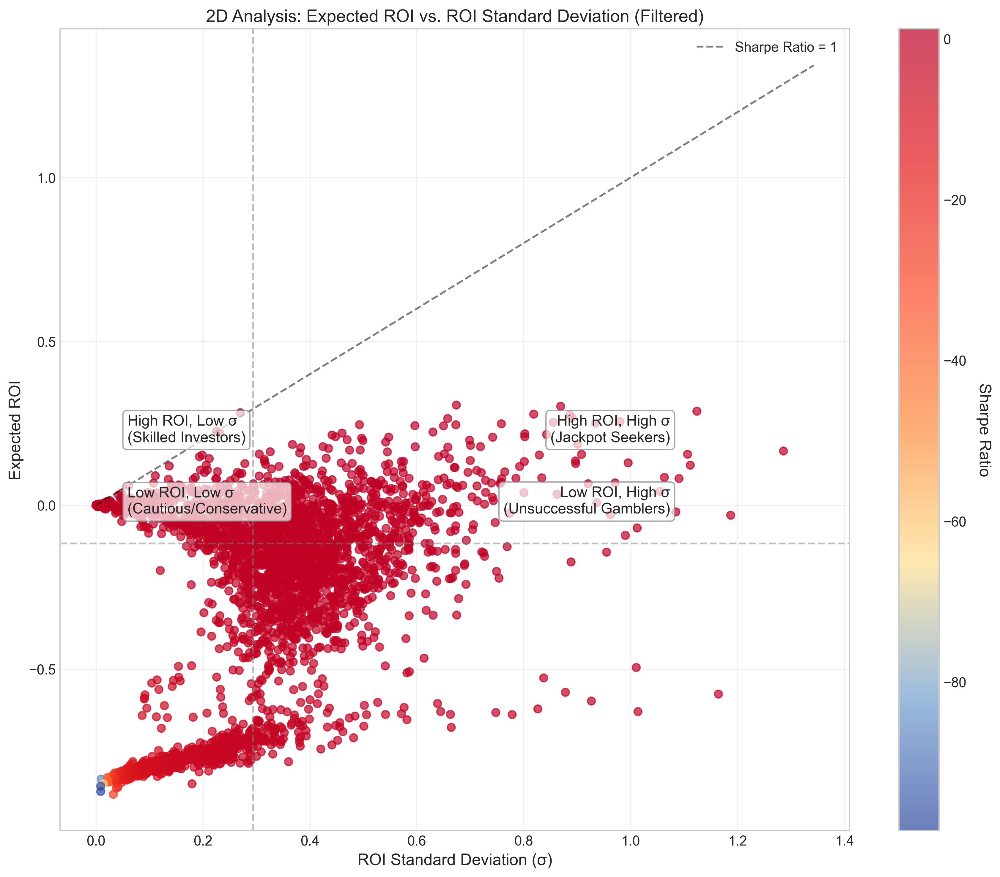
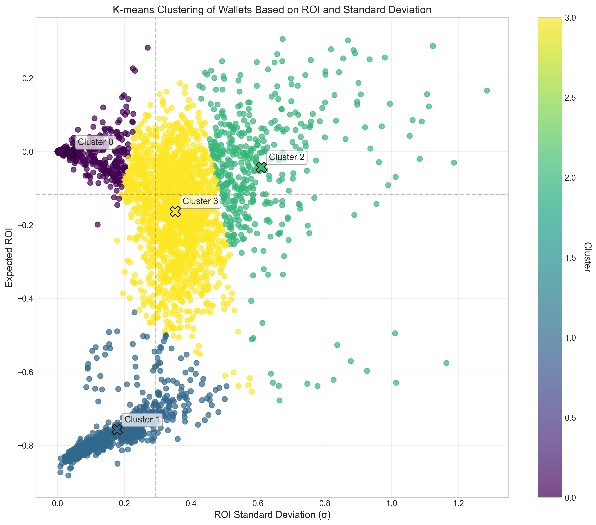
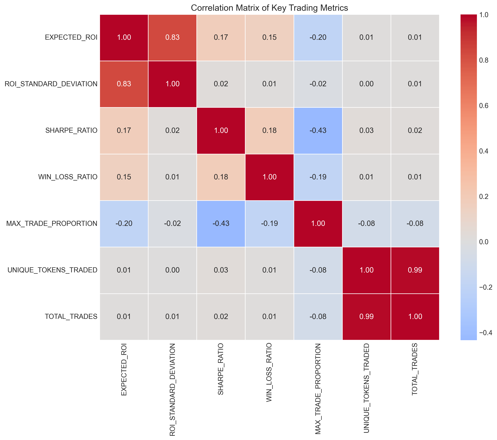
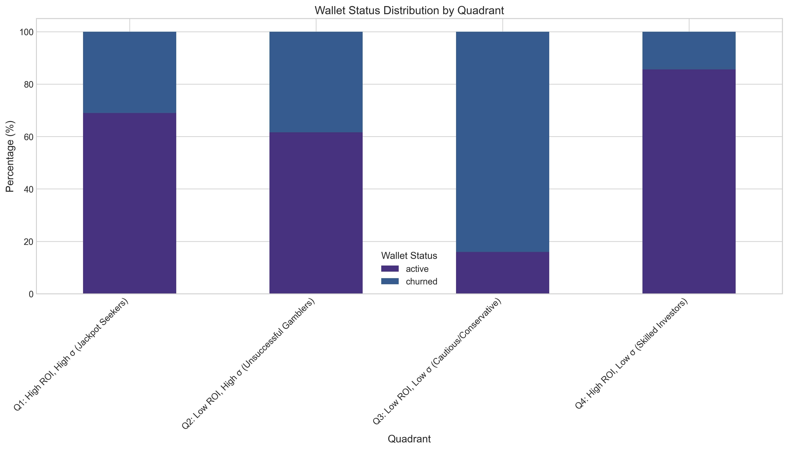

# Sharpe Ratio vs. ROI Standard Deviation Analysis - Summary

## Key Findings

### 1. Four Trading Profiles Identified

Our analysis identified four distinct trading profiles based on Expected ROI and ROI Standard Deviation:

1. **Jackpot Seekers** (High ROI, High σ): Traders who accept high volatility in pursuit of high returns
2. **Unsuccessful Gamblers** (Low ROI, High σ): Traders who take high risks but achieve poor returns
3. **Cautious/Conservative** (Low ROI, Low σ): Traders with minimal risk-taking and low returns
4. **Skilled Investors** (High ROI, Low σ): Traders who achieve good returns with minimal volatility

### 2. Jackpot Seeking Behavior Analysis

- **Jackpot Seekers** achieved the highest average returns but with extreme volatility
- This high-risk strategy shows moderate churn rates (33.6%), suggesting it works for some but not all
- Jackpot Seekers had higher trading activity (average of 305 trades) than other groups

### 3. Risk-Return Trade-off

- Strong positive correlation (+0.74) between Expected ROI and ROI Standard Deviation
- Higher returns generally come with higher volatility in this market
- This confirms the risk-return tradeoff theory in cryptocurrency trading

### 4. Wallet Retention by Strategy

- **Highest churn rate (39.5%)** observed in "Unsuccessful Gamblers" (low ROI, high σ)
- **Lowest churn rate (31.5%)** found among "Skilled Investors" (high ROI, low σ)
- Traders who achieve good returns with low volatility are most likely to remain active

### 5. Sharpe Ratio Insights

- Skilled Investors demonstrated the highest Sharpe ratios (0.37 on average)
- Win-Loss ratio and Sharpe ratio show a positive correlation (+0.53)
- Better trade selection (not just higher returns) leads to more sustainable trading performance

## Conclusions

1. **Risk-Return Tradeoff**: The positive correlation between ROI and volatility confirms that higher returns generally require accepting higher risk in cryptocurrency trading.

2. **Jackpot Seeking Viability**: While the jackpot-seeking strategy can produce the highest returns, it's not sustainable for everyone, as shown by the moderate churn rate.

3. **Skill vs. Luck**: The "Skilled Investors" group suggests that some traders can consistently achieve good returns with lower volatility through better trade selection.

4. **Trading Frequency**: Higher trading activity doesn't necessarily correlate with better performance. Quality of trades (Win-Loss ratio) matters more than quantity.

5. **Churn Prediction**: Volatility coupled with poor returns is the strongest predictor of wallet abandonment.

## Recommendations

1. **For Traders**:
   - Monitor your risk-adjusted returns (Sharpe Ratio), not just absolute ROI
   - Focus on improving trade selection rather than increasing position sizes
   - Consider if the volatility you're accepting is proportional to your expected returns

2. **For Platforms**:
   - Develop tools to help users understand their risk profile and trading behavior
   - Identify users showing "Unsuccessful Gambler" patterns for targeted retention efforts
   - Consider rewarding or highlighting traders with consistently strong risk-adjusted returns

## Detailed Reports and Data

- [Comprehensive Analysis Report](sharpe_roi_analysis_report.md)
- [Quadrant Statistics](quadrant_statistics.csv)
- [Cluster Statistics](cluster_statistics.csv)

---

*Analysis based on data from 3,822 wallets over the period of Jan-Apr 2025.* 