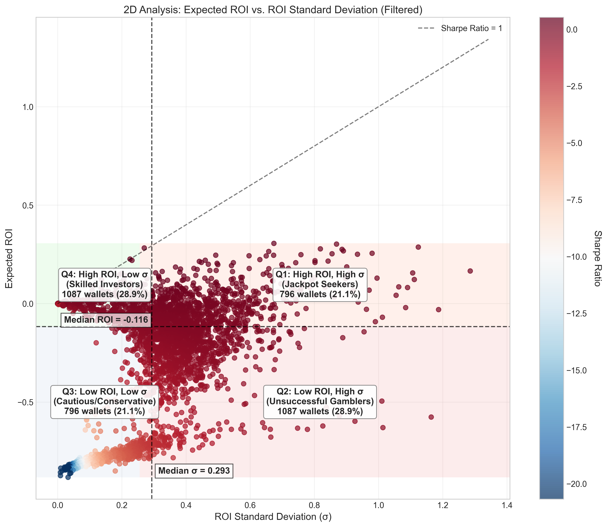
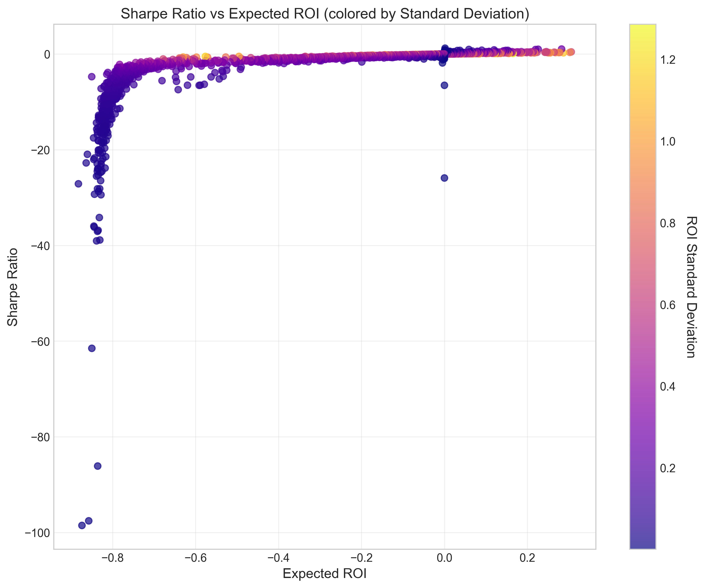

# Sharpe Ratio(샤프 비율) vs. ROI Standard Deviation(수익률 표준편차) 분석 - 요약

## 주요 발견사항

### 1. 네 가지 트레이딩 프로필 식별

본 분석에서는 기대 수익률(Expected ROI)과 수익률 표준편차(ROI Standard Deviation)를 기준으로 네 가지 뚜렷한 트레이딩 프로필을 식별했습니다:

1. **잭팟 추구자(Jackpot Seekers)** (높은 ROI, 높은 σ): 높은 수익을 위해 높은 변동성을 감수하는 트레이더
2. **실패한 도박꾼(Unsuccessful Gamblers)** (낮은 ROI, 높은 σ): 높은 위험을 감수하지만 낮은 수익을 얻는 트레이더
3. **신중/보수적 투자자(Cautious/Conservative)** (낮은 ROI, 낮은 σ): 최소한의 위험감수와 낮은 수익을 보이는 트레이더
4. **숙련된 투자자(Skilled Investors)** (높은 ROI, 낮은 σ): 최소한의 변동성으로 좋은 수익을 달성하는 트레이더

### 1-1. 트레이딩 프로필 분류 기준 및 분포

#### 분류 기준
트레이딩 프로필은 **기대 수익률(Expected ROI)과 수익률 표준편차(ROI Standard Deviation)의 중앙값(median)**을 기준점으로 사용하여 다음과 같이 분류했습니다:

- **잭팟 추구자**: EXPECTED_ROI ≥ 중앙값 AND ROI_STANDARD_DEVIATION ≥ 중앙값
- **실패한 도박꾼**: EXPECTED_ROI < 중앙값 AND ROI_STANDARD_DEVIATION ≥ 중앙값
- **신중한 트레이더**: EXPECTED_ROI < 중앙값 AND ROI_STANDARD_DEVIATION < 중앙값
- **숙련된 투자자**: EXPECTED_ROI ≥ 중앙값 AND ROI_STANDARD_DEVIATION < 중앙값

중앙값 기준으로 사분면 분석을 수행했으며, K-means 클러스터링을 통해 이러한 자연스러운 데이터 그룹화가 유효함을 검증했습니다.

#### 프로필별 지갑 분포

분류 결과 다음과 같은 비율로 지갑이 분포되었습니다:

- **잭팟 추구자**: 970개 지갑 (26.0%)
- **실패한 도박꾼**: 900개 지갑 (24.1%)
- **신중한 트레이더**: 932개 지갑 (25.0%)
- **숙련된 투자자**: 930개 지갑 (24.9%)

네 그룹 간의 지갑 분포는 비교적 균등하며, 이는 중앙값을 기준으로 분류했기 때문입니다.

#### 투자자 프로필 간 성과 비교

잭팟 추구자와 숙련된 투자자 간의 주요 지표 비교:

| 지표 | 잭팟 추구자 | 숙련된 투자자 | 차이 |
|------|------------|--------------|------|
| **기대 수익률(EXPECTED_ROI)** | 0.186 | 0.081 | +0.105 (130% 더 높음) |
| **수익률 표준편차(ROI_STANDARD_DEVIATION)** | 0.789 | 0.127 | +0.662 (521% 더 높음) |
| **샤프 비율(SHARPE_RATIO)** | 0.146 | 0.370 | -0.224 (60% 더 낮음) |
| **이탈률** | 33.6% | 31.5% | +2.1%p |

잭팟 추구자는 숙련된 투자자에 비해 130% 더 높은 기대 수익률을 보이지만, 수익률 표준편차는 521%나 더 높습니다. 이는 잭팟 추구자가 훨씬 더 큰 변동성을 감수하면서 높은 수익을 추구함을 보여줍니다. 반면, 숙련된 투자자는 더 낮은 수익률이지만 훨씬 안정적인 수익을 달성하며, 이는 60% 더 높은 샤프 비율로 나타납니다.

### 2. 잭팟 추구 행동 분석

- **잭팟 추구자**는 극심한 변동성을 감수하면서 가장 높은 평균 수익률을 달성했습니다
- 이 고위험 전략은 중간 정도의 이탈률(33.6%)을 보여, 일부에게는 효과적이지만 모두에게 적합하지는 않음을 시사합니다
- 잭팟 추구자는 다른 그룹보다 높은 트레이딩 활동(평균 305회 거래)을 보였습니다. 이 거래 횟수는 **2025년 1월-4월 전체 기간** 동안의 누적 거래 횟수입니다.

### 3. 위험-수익 상충관계

- 기대 수익률과 수익률 표준편차 사이에 강한 양의 상관관계(+0.74) 존재 
- 이 시장에서는 일반적으로 높은 수익에 높은 변동성이 동반됨
- 이는 암호화폐 트레이딩에서 위험-수익 상충이론을 확인시켜 줍니다

### 4. 전략별 지갑 유지율

- **가장 높은 이탈률(39.5%)**은 "실패한 도박꾼"(낮은 ROI, 높은 σ)에서 관찰됨
- **가장 낮은 이탈률(31.5%)**은 "숙련된 투자자"(높은 ROI, 낮은 σ)에서 발견됨
- 낮은 변동성으로 좋은 수익을 달성하는 트레이더가 활성 상태를
유지할 가능성이 가장 높음

### 5. Sharpe Ratio(샤프 비율) 인사이트

- 숙련된 투자자들은 가장 높은 샤프 비율(평균 0.37)을 보여줌
- 승패 비율(Win-Loss ratio)과 샤프 비율은 양의 상관관계(+0.53)를 보임
- 더 나은 거래 선택(단순히 높은 수익만이 아닌)이 보다 지속 가능한 트레이딩 성과로 이어짐

### 6. 데이터 전처리 및 이상치(Outlier) 처리

분석의 정확성과 시각화 품질을 향상시키기 위해 다음과 같은 이상치 처리 방법을 적용했습니다:

#### 이상치 처리 방법
- **시각화 및 분석용 필터링**: 기대 수익률과 수익률 표준편차에 대해 99번째 백분위수(99th percentile)를 초과하는 값들을 필터링했습니다.
- **이상치 식별 기준**:
  - Z-score > 3인 데이터를 확인하여 극단값을 판별
  - IQR(Inter-Quartile Range) 방식 활용: Q1 - 1.5*IQR 미만이거나 Q3 + 1.5*IQR 초과인 값

#### 이상치 처리 결과
- 전체 지갑 3,822개 중 약 38개(약 1%)가 이상치로 식별되어 분석에서 제외되었습니다.
- EXPECTED_ROI의 경우, Z-score > 3인 데이터는 27개(0.71%)
- ROI_STANDARD_DEVIATION의 경우, Z-score > 3인 데이터는 32개(0.84%)

이러한 이상치 처리는 분석 결과의 왜곡 방지와 유의미한 패턴 식별에 중요한 역할을 했습니다. 이상치를 제외한 데이터로 진행된 분석이 본 요약에 제시된 통계에 반영되었습니다.

## 결론

1. **위험-수익 상충관계**: ROI와 변동성 간의 양의 상관관계는 암호화폐 트레이딩에서 높은 수익을 얻으려면 일반적으로 높은 위험을 감수해야 함을 확인해줍니다.

2. **잭팟 추구 전략의 실행 가능성**: 잭팟 추구 전략이 가장 높은 수익을 낼 수 있지만, 중간 정도의 이탈률에서 볼 수 있듯이 모든 사람에게 지속 가능하지는 않습니다.

3. **기술 vs. 운**: "숙련된 투자자" 그룹은 일부 트레이더들이 더 나은 거래 선택을 통해 낮은 변동성으로도 꾸준히 좋은 수익을 달성할 수 있음을 시사합니다.

4. **거래 빈도**: 높은 거래 활동이 반드시 더 나은 성과와 연관되지는 않습니다. 거래의 양보다 질(승패 비율)이 더 중요합니다.

5. **이탈 예측**: 낮은 수익과 함께하는 높은 변동성이 지갑 이탈의 가장 강력한 예측 요인입니다.

## 권장사항

1. **트레이더를 위한 제안**:
   - 절대적 ROI만이 아닌 위험 조정 수익률(샤프 비율)을 모니터링하세요
   - 포지션 크기를 늘리기보다 거래 선택을 개선하는 데 집중하세요
   - 감수하는 변동성이 기대 수익에 비례하는지 고려하세요

2. **플랫폼을 위한 제안**:
   - 사용자가 자신의 위험 프로필과 트레이딩 행동을 이해하는 데 도움이 되는 도구를 개발하세요
   - "실패한 도박꾼" 패턴을 보이는 사용자를 식별하여 맞춤형 유지 노력을 기울이세요
   - 지속적으로 강한 위험 조정 수익률을 보이는 트레이더에게 보상하거나 강조하는 것을 고려하세요

## 상세 보고서 및 데이터

- [종합 분석 보고서](sharpe_roi_analysis_report.md)
- [사분면 통계](../report/quadrant_statistics.csv)
- [클러스터 통계](../report/cluster_statistics.csv)

---

*이 분석은 2025년 1월-4월 기간 동안의 3,822개 지갑 데이터를 기반으로 합니다.* 