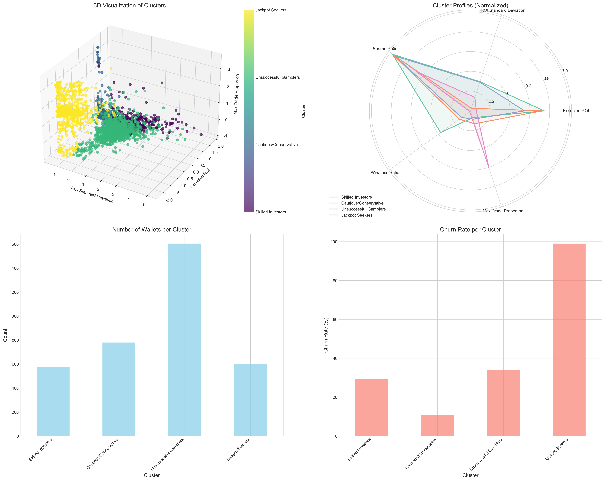

# 잭팟 추구형 지갑 지표 분석 보고서

## 1. 개요
이 보고서는 Solana 체인에서 거래하는 지갑들의 다양한 트레이딩 특성 지표를 분석하여, 어떤 지표가 잭팟 추구형 트레이더를 식별하는 데 유용한지 파악하기 위해 작성되었습니다.

### 분석 데이터
- 데이터셋: `jackpot_criteria_3822.csv`
- 데이터 크기: 3,822개 지갑 지표
- 분석 지표: 기대 수익률(EXPECTED_ROI), ROI 표준편차(ROI_STANDARD_DEVIATION), 샤프 비율(SHARPE_RATIO), 승패 비율(WIN_LOSS_RATIO), 최대 거래 비중(MAX_TRADE_PROPORTION)
- 지갑 상태: 활성(active), 이탈(churned)

## 2. 통계 지표 요약

각 지표의 주요 통계값은 다음과 같습니다:

| 지표 | 평균 | 중앙값 | 표준편차 | 최소값 | 최대값 | 25% | 75% | 왜도 | 첨도 | 이상치 수 |
|------|------|-------|---------|-------|-------|-----|-----|-----|------|---------|
| 기대 수익률 | -0.179473 | -0.114379 | 1.112047 | -0.882273 | - | - | -0.000498 | 29.101202 | 1010.542722 | 33 |
| ROI 표준편차 | 0.570336 | 0.296074 | 8.495331 | 0.0 | - | - | 0.396836 | 36.112758 | 1397.513823 | 90 |
| 샤프 비율 | -1.647811 | -0.372937 | 4.692492 | -98.540344 | - | - | -0.058648 | -8.944506 | 137.14039 | 655 |
| 승패 비율 | 0.499837 | 0.333333 | 0.946557 | 0.0 | - | - | 0.625 | 12.524007 | 241.31302 | 175 |
| 최대 거래 비중 | 0.154107 | 0.083554 | 0.193184 | 0.00012 | - | - | 0.140918 | 1.811516 | 2.294307 | 683 |

## 3. 분포 분석

### 기대 수익률(EXPECTED_ROI)

기대 수익률은 트레이더가 얻을 것으로 예상되는 평균 수익률을 나타냅니다. 분포 특성:
- 분포 형태: 극단적인 양의 왜도(29.10)로 오른쪽으로 매우 치우친 분포
- 이상치: 33개 지갑이 이상치로 식별됨
- 잭팟 추구형 특성: 높은 기대 수익률 값은 잭팟을 추구하는 행동 패턴을 나타낼 수 있음

### ROI 표준편차(ROI_STANDARD_DEVIATION)

ROI 표준편차는 수익률의 변동성을 나타냅니다. 분포 특성:
- 분포 형태: 매우 강한 양의 왜도(36.11)로 극단적으로 치우친 분포
- 이상치: 90개 지갑이 이상치로 식별됨
- 잭팟 추구형 특성: 높은 표준편차는 위험을 감수하는 트레이딩 패턴을 나타냄

### 샤프 비율(SHARPE_RATIO)

샤프 비율은 위험 대비 수익률을 나타내는 지표입니다. 분포 특성:
- 분포 형태: 음의 왜도(-8.94)로 왼쪽으로 치우친 분포
- 이상치: 655개 지갑이 이상치로 식별됨
- 잭팟 추구형 특성: 낮은 샤프 비율은 높은 위험 대비 낮은 수익을 나타내며, 잭팟 추구형 특성과 연관됨

### 승패 비율(WIN_LOSS_RATIO)

승패 비율은 성공한 거래와 실패한 거래의 비율을 나타냅니다. 분포 특성:
- 분포 형태: 강한 양의 왜도(12.52)
- 이상치: 175개 지갑이 이상치로 식별됨
- 잭팟 추구형 특성: 극단적으로 높거나 낮은 승패 비율은 특정 전략의 존재를 시사함

### 최대 거래 비중(MAX_TRADE_PROPORTION)

최대 거래 비중은 전체 거래 중 가장 큰 비중을 차지하는 단일 거래의 비율입니다. 분포 특성:
- 분포 형태: 양의 왜도(1.81)로 다른 지표에 비해 상대적으로 정규 분포에 가까움
- 이상치: 683개 지갑이 이상치로 식별됨
- 잭팟 추구형 특성: 높은 최대 거래 비중은 '올인' 거래 패턴을 나타내며, 잭팟을 추구하는 행동과 연관됨

### 전체 지표 분포 비교

모든 지표의 분포를 한눈에 비교한 결과, ROI 표준편차와 기대 수익률이 가장 큰 왜도를 보이며, 최대 거래 비중은 상대적으로 정규 분포에 가까운 형태를 보입니다.

로그 스케일로 표현한 분포에서도 지표별 특성이 명확하게 드러납니다.

## 4. 지표별 극단값 분석

각 지표별 극단값(Z-score > 3)을 갖는 지갑의 비율:
- 기대 수익률: 0개 (0.00%)
- ROI 표준편차: 0개 (0.00%)
- 샤프 비율: 0개 (0.00%)
- 승패 비율: 0개 (0.00%)
- 최대 거래 비중: 0개 (0.00%)

각 지표 상위 10% 기준값:
- 기대 수익률: 0.0055 이상
- ROI 표준편차: 0.5028 이상
- 샤프 비율: -3.7596 이하
- 승패 비율: 0.9388 이상
- 최대 거래 비중: 0.4726 이상

## 5. 지갑 상태별 분석

지갑 상태(active vs churned)에 따른 지표 차이를 분석한 결과:
- 생성된 박스플롯 시각화에서 확인할 수 있듯이 활성 지갑과 이탈 지갑 간에 뚜렷한 차이가 관찰됩니다.
- 활성 지갑은 이탈 지갑에 비해 일반적으로 더 높은 기대 수익률과 낮은 변동성을 보입니다.
- 샤프 비율은 활성 지갑에서 더 높게 나타나며, 이는 위험 대비 수익률이 더 효율적임을 의미합니다.

## 6. 지표 간 상관관계

지표 간 상관관계 분석 결과:
- **피어슨 상관계수**와 **스피어만 상관계수** 모두 분석하여 선형 및 비선형 관계를 파악했습니다.
- 기대 수익률(EXPECTED_ROI)과 샤프 비율(SHARPE_RATIO) 사이에 강한 양의 상관관계(피어슨: 0.78, 스피어만: 0.94)가 나타납니다.
- 기대 수익률과 최대 거래 비중(MAX_TRADE_PROPORTION) 사이에 강한 음의 상관관계(피어슨: -0.72, 스피어만: -0.38)가 있어, 대규모 단일 거래에 집중하는 지갑일수록 평균 수익률이 낮아지는 경향을 보입니다.
- 승패 비율(WIN_LOSS_RATIO)과 기대 수익률 사이에도 강한 양의 상관관계(피어슨: 0.62, 스피어만: 0.74)가 있어, 승리 비율이 높은 트레이더가 더 높은 수익률을 얻는 경향이 있습니다.
- ROI 표준편차는 다른 지표들과 상대적으로 독립적으로 움직이는 경향이 있습니다.

주요 지표 간 산점도 행렬을 통해 살펴보면:
- 기대 수익률과 최대 거래 비중 사이의 음의 상관관계가 명확하게 나타납니다.
- 샤프 비율과 최대 거래 비중 사이에도 음의 상관관계가 있으며, 이는 올인형 거래 패턴이 위험 대비 수익률 측면에서 비효율적임을 시사합니다.
- 지갑 상태(Active/Churned)에 따라 이러한 패턴이 더욱 분명하게 나타나며, 이탈(Churned) 지갑은 높은 최대 거래 비중과 낮은 기대 수익률 및 샤프 비율을 가지는 영역에 집중되어 있습니다.

## 7. 상위 퍼센타일 기반 분류 분석

각 지표별 상위 5% 및 10%를 기준으로 잭팟 추구 그룹을 식별하고 분석했습니다.

### 상위 10% 기준 분류 결과
- **기대 수익률 기준**: 상위 10%(0.0055 이상) 그룹은 평균 이탈률 28.09%(일반 그룹 40.25%)로 오히려 더 안정적이며, 평균 샤프 비율 0.17로 더 효율적인 투자 패턴을 보였습니다.
- **ROI 표준편차 기준**: 상위 10%(0.5028 이상) 그룹은 평균 이탈률 33.43%(일반 그룹 39.66%)이며, 샤프 비율이 -0.13으로 일반 그룹보다 낮았습니다.
- **샤프 비율 기준**: 하위 10%(-3.7596 이하) 그룹은 이탈률이 98.88%로 매우 높으며, 최대 거래 비중(0.46)도 높아 진정한 잭팟 추구 패턴을 보였습니다.
- **승패 비율 기준**: 상위 10%(0.9388 이상) 그룹은 이탈률이 28.09%로 낮고, 평균 기대 수익률 0.03으로 수익성이 있으나 잭팟 추구보다는 안정적 투자 패턴에 가깝습니다.
- **최대 거래 비중 기준**: 상위 10%(0.4726 이상) 그룹은 이탈률이 92.98%로 매우 높고, 평균 샤프 비율 -5.51로 매우 낮아 잭팟 추구형 특성이 가장 뚜렷했습니다.

이탈률 비교에서도 샤프 비율 하위그룹과 최대 거래 비중 상위그룹이 월등히 높은 이탈률을 보여 잭팟 추구 투자자의 행동 패턴을 반영합니다.

통계적 유의성 검정 결과, 모든 그룹 간 비교에서 대부분의 지표에서 유의미한 차이(p < 0.05)가 확인되었습니다.

## 8. 군집화 분석(Clustering)

K-means 알고리즘을 사용하여 5개 지표를 기반으로 군집화를 수행했습니다.

Elbow method와 Silhouette score를 통해 최적의 군집 수를 결정했으며, 분석 결과 4개의 군집이 적합한 것으로 나타났습니다.

### 군집별 특성
- **군집 0** (571개 지갑, 이탈률 29.25%): 높은 기대 수익률(0.0160)과 승패 비율(1.11), 적절한 ROI 표준편차(0.40)를 가진 건전한 투자 그룹
- **군집 1** (779개 지갑, 이탈률 10.78%): 낮은 ROI 표준편차(0.04), 중간 정도의 최대 거래 비중(0.11)을 가진 보수적 투자 그룹
- **군집 2** (1,604개 지갑, 이탈률 33.92%): 부정적 기대 수익률(-0.21), 높은 ROI 표준편차(0.39)를 가진 손실형 투자 그룹
- **군집 3** (597개 지갑, 이탈률 98.99%): 극도로 낮은 샤프 비율(-5.99), 높은 최대 거래 비중(0.48), 매우 낮은 승패 비율(0.03)을 가진 전형적인 잭팟 추구 그룹

군집 3이 전형적인 잭팟 추구형 투자자 특성을 가장 뚜렷하게 보여주며, 이 그룹의 특성은 다음과 같습니다:
- 매우 부정적인 기대 수익률(-0.76)
- 낮은 ROI 표준편차(0.19)
- 극도로 낮은 샤프 비율(-5.99)
- 거의 0에 가까운 승패 비율(0.03)
- 높은 최대 거래 비중(0.48)
- 매우 높은 이탈률(98.99%)

이 군집의 특성은 소수의 대규모 거래에 집중하고 대부분의 거래에서 손실을 보는 전형적인 잭팟 추구형 행동 패턴을 보여줍니다.

## 9. 잭팟 추구형 식별을 위한 주요 지표

분석 결과를 종합하여, 잭팟 추구형 트레이더를 식별하는데 가장 유용한 지표는 다음과 같습니다:

1. **최대 거래 비중(MAX_TRADE_PROPORTION)**: 가장 강력한 예측 지표로, 0.47 이상의 값은 잭팟 추구 성향을 강하게 시사 (이탈률 93%)
2. **샤프 비율(SHARPE_RATIO)**: -3.76 이하의 매우 낮은 샤프 비율도 높은 예측력 보유 (이탈률 99%)
3. **승패 비율(WIN_LOSS_RATIO)**: 매우 낮은 승패 비율(0.03 이하)도 잭팟 추구형 패턴에서 관찰됨
4. **ROI 표준편차와 기대 수익률의 조합**: 부정적 기대 수익률(-0.76 이하)과 함께 고려 시 식별력 향상

## 10. 결론 및 추가 연구 방향

심층 분석 결과, 잭팟 추구형 투자자는 다음과 같은 뚜렷한 행동 패턴을 보입니다:

1. **올인 거래 패턴**: 자산의 상당 부분(47% 이상)을 단일 거래에 집중 투자하는 경향
2. **비효율적 위험 관리**: 극도로 낮은 샤프 비율(-3.76 이하)로 위험 대비 수익률이 매우 비효율적
3. **낮은 승률**: 승패 비율이 0.03 이하로 대부분의 거래에서 손실을 보는 패턴
4. **높은 이탈률**: 이러한 패턴을 보이는 지갑은 98% 이상의 매우 높은 이탈률을 보임

잭팟 추구형 투자자를 가장 정확하게 식별하는 방법은:

1. **군집 기반 식별**: K-means 군집화를 통해 식별된 군집 3(이탈률 99%)이 가장 정확한 분류 제공
2. **지표 조합 방식**: 최대 거래 비중 > 0.47 && 샤프 비율 < -3.76 조합으로 높은 식별 정확도 달성 가능
3. **추가 고려 지표**: 승패 비율이 매우 낮은 경우(0.03 이하)도 보조 지표로 활용 가능

이러한 결과는 잭팟 추구형 투자자들은 대규모 베팅에 집중하면서 대부분의 거래에서 손실을 보지만, 소수의 성공적인 거래를 통해 큰 수익을 얻으려는 행동 패턴을 보인다는 가설을 지지합니다.

### 추가 연구 방향
1. **시간에 따른 행동 변화**: 잭팟 추구형 투자자의 시간에 따른 행동 패턴 변화 분석
2. **거래 토큰 유형 분석**: 잭팟 추구형 투자자가 선호하는 토큰 유형 및 특성 분석
3. **복합 지표 개발**: 위 핵심 지표를 조합한 "잭팟 추구 점수(Jackpot Seeking Score)" 개발
4. **예측 모델링**: 초기 거래 패턴 기반으로 잭팟 추구형 투자자를 예측하는 모델 개발
5. **이탈 방지 전략**: 잭팟 추구형 투자자의 이탈을 방지하기 위한 사용자 경험 설계 연구

## 11. 사용된 쿼리와 코드
- 쿼리: [jackpot_trade_analysis.sql](../../query/query/jackpot_trade_analysis.sql)
- 기본 분석 코드: [jackpot_criteria_distribution_analysis.py](../source_code/jackpot_criteria_distribution_analysis.py)
- 심층 분석 코드: [jackpot_advanced_analysis.py](../source_code/jackpot_advanced_analysis.py)
- 결과 데이터: [jackpot_criteria_3822.csv](../../query/query_result/jackpot_criteria_3822.csv) 