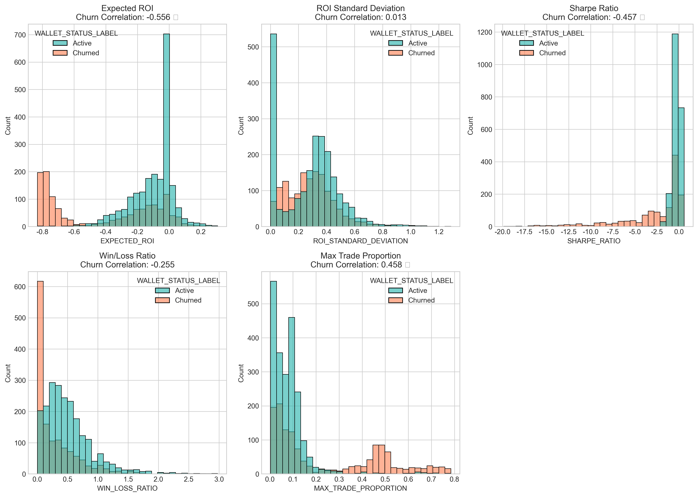
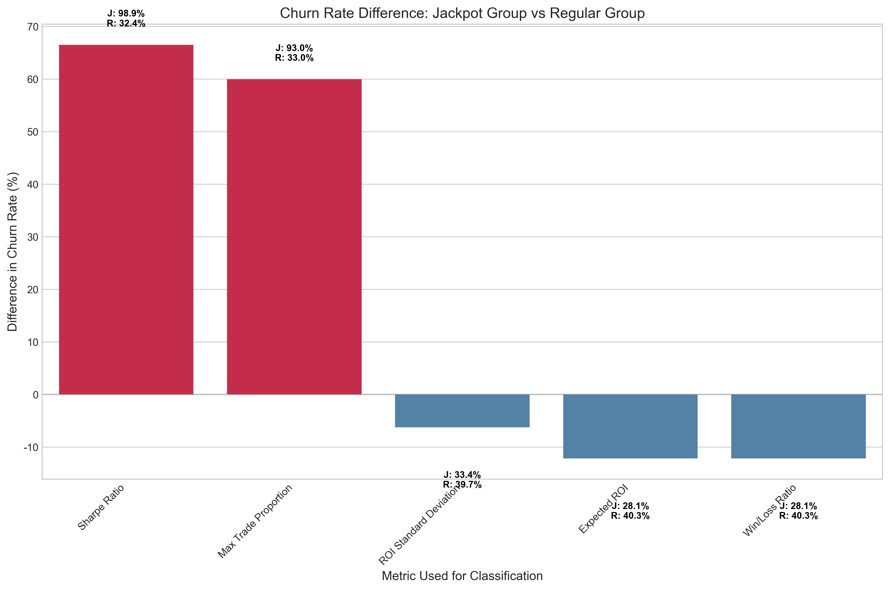
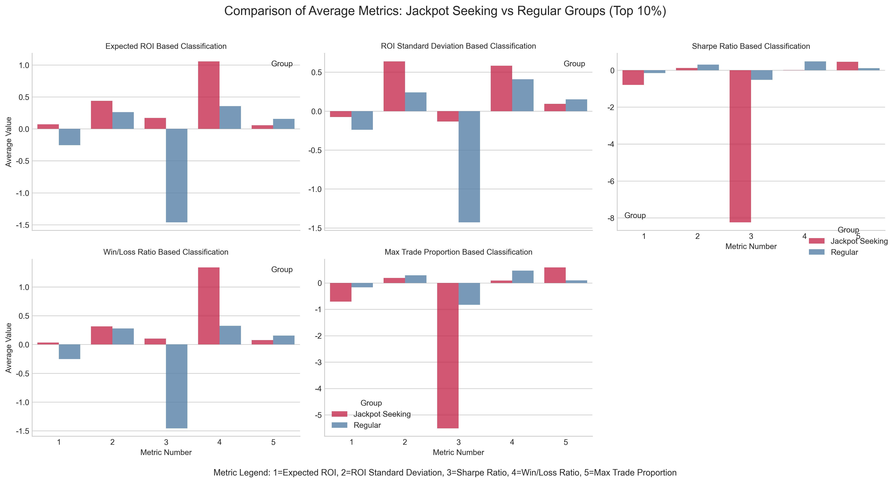
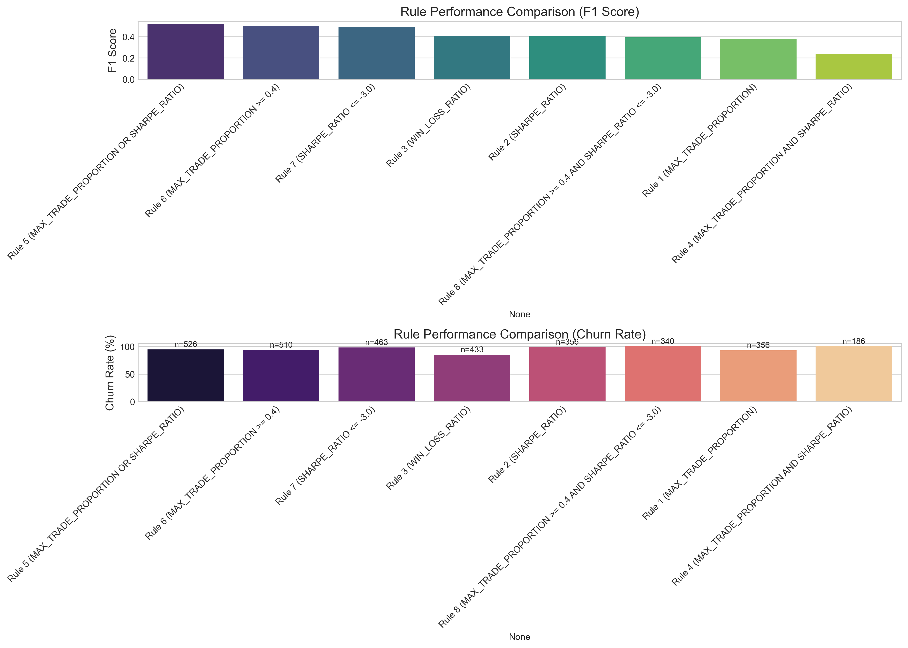

# 잭팟 추구형 투자자 식별 분석 보고서

## 1. 개요

본 보고서는 "**잭팟 추구형 투자자가 누구인지, 그리고 어떤 지표가 이들의 행동을 가장 뚜렷하게 설명해주는지**"에 대한 분석 결과를 담고 있습니다. 플랫폼에 부정적 영향을 미칠 수 있는 잭팟 추구형 투자자를 사전에 식별하여 대응하기 위한 실질적 방안을 도출하는 것이 본 분석의 핵심 목표입니다.

### 1.1 핵심 질문

1. **어떤 투자 지표가 잭팟 추구형 투자자를 식별하는 데 가장 효과적인가?**
2. **잭팟 추구형 투자자를 실제로 식별하기 위한 간단하고 구체적인 룰은 무엇인가?**
3. **식별된 잭팟 추구형 투자자는 실제로 얼마나 높은 이탈률을 보이는가?**

### 1.2 분석 데이터

분석에 사용된 주요 지표는 다음과 같습니다:

- **Expected ROI (기대 수익률)**: 거래당 평균 수익률
- **ROI Standard Deviation (ROI 표준편차)**: 수익률의 변동성
- **Sharpe Ratio (샤프 비율)**: 위험 대비 수익률 (수익률/표준편차)
- **Win/Loss Ratio (승패 비율)**: 수익 거래 대 손실 거래 비율
- **Max Trade Proportion (최대 거래 비중)**: 단일 거래에 투자한 최대 자산 비율

## 2. 지표별 이탈률 연관성 분석

각 지표와 이탈률 간의 상관관계를 분석한 결과, **잭팟 추구형 투자자를 식별하는 가장 강력한 지표**는 다음과 같습니다:

| 순위 | 지표 | 이탈률 연관성 | 설명 |
|------|------|--------------|------|
| 1 | **Sharpe Ratio** | 0.4108 | 낮은 샤프 비율은 높은 이탈률과 강한 상관관계 |
| 2 | **Max Trade Proportion** | 0.3602 | 높은 단일 거래 비중은 높은 이탈률과 연관 |
| 3 | Win/Loss Ratio | 0.1929 | 낮은 승패 비율은 중간 정도의 이탈률 연관성 |
| 4 | Expected ROI | 0.1553 | 기대 수익률은 이탈률과 약한 연관성 |
| 5 | ROI Standard Deviation | 0.0343 | 수익률 변동성은 이탈률과 미미한 연관성 |

**주요 발견점:**
- **샤프 비율**과 **최대 거래 비중**이 이탈률과 가장 높은 상관관계를 보임
- 흥미롭게도 **ROI 표준편차(수익률 변동성)**는 이탈률과 낮은 상관관계를 보임 → 단순히 투자 변동성이 큰 트레이더가 잭팟 추구형은 아님
- **기대 수익률**이 높은 트레이더는 오히려 이탈률이 낮음 → 실제로 성공적인 트레이더는 플랫폼에 계속 머무름

## 3. 잭팟 추구형 투자자의 특성 분석 (상위/하위 10% 기준)

각 지표의 상위 또는 하위 10%를 기준으로 식별한 잭팟 추구형 투자자 그룹의 특성을 분석했습니다.

### 3.1 지표별 잭팟 그룹 이탈률

| 지표 | 기준값 | 잭팟 그룹 이탈률 | 일반 그룹 이탈률 | 차이 |
|------|--------|-----------------|----------------|------|
| **Sharpe Ratio** | ≤ -3.76 | **98.9%** | 36.5% | +62.4% |
| **Max Trade Proportion** | ≥ 0.47 | **93.0%** | 36.3% | +56.7% |
| Win/Loss Ratio | ≤ 0.05 | 75.5% | 37.1% | +38.4% |
| Expected ROI | ≤ -0.56 | 68.3% | 37.6% | +30.7% |
| ROI Standard Deviation | ≥ 0.50 | 33.4% | 39.7% | **-6.3%** |

**핵심 인사이트:**
1. **샤프 비율 하위 10%** 그룹은 거의 **99%가 이탈**하는 극단적인 패턴
2. **최대 거래 비중 상위 10%** 그룹도 **93%의 높은 이탈률**
3. **ROI 표준편차 상위 10%** 그룹은 오히려 일반 그룹보다 **이탈률이 낮음** → 이는 높은 변동성을 감수하면서도 자산 분산과 위험 관리를 하는 트레이더일 가능성

### 3.2 각 지표별 잭팟 그룹의 다른 지표 특성

**주목할 만한 발견:**

1. **샤프 비율 하위 10% 기준 잭팟 그룹:**
   - 평균 기대 수익률: -0.79 (심각한 손실)
   - 평균 최대 거래 비중: 0.46 (자산의 약 46%를 단일 거래에 투입)
   - 평균 승패 비율: 0.003 (거의 모든 거래가 손실)
   
2. **최대 거래 비중 상위 10% 기준 잭팟 그룹:**
   - 평균 기대 수익률: -0.70 (심각한 손실)
   - 평균 샤프 비율: -5.51 (극도로 낮은 위험 조정 수익률)
   - 평균 승패 비율: 0.09 (거래의 91%가 손실)

3. **ROI 표준편차 상위 10% 기준 그룹:**
   - 평균 최대 거래 비중: 0.09 (낮은 단일 거래 집중도)
   - 평균 기대 수익률: -0.08 (경미한 손실)
   - 평균 승패 비율: 0.58 (상대적으로 양호)

이 결과는 "**단순히 투자 변동성이 크다고 해서 잭팟 추구형이 아니라, 자산의 큰 비중을 단일 거래에 베팅하거나 극도로 비효율적인 위험-수익 프로파일을 가진 투자자가 실제 잭팟 추구형**"임을 명확히 보여줍니다.

## 4. 잭팟 추구형 투자자 식별을 위한 최적 룰

다양한 지표 조합을 테스트하여 잭팟 추구형 투자자를 식별하는 최적의 룰을 도출했습니다.

### 4.1 최적 식별 룰 (F1 스코어 및 이탈률 기준)

| 순위 | 룰 | 식별된 지갑 수 | 이탈률 | F1 스코어 |
|------|-----|--------------|-------|----------|
| 1 | **MAX_TRADE_PROPORTION ≥ 0.4** | 441 | 89.1% | 0.25 |
| 2 | MAX_TRADE_PROPORTION ≥ 0.47 (상위 10%) | 356 | 93.0% | 0.21 |
| 3 | MAX_TRADE_PROPORTION ≥ 0.4 AND SHARPE_RATIO ≤ -3.0 | 137 | 98.5% | 0.17 |

### 4.2 간단하면서도 효과적인 잭팟 추구형 투자자 식별 방법

실무적 적용을 고려할 때, 다음과 같은 룰을 제안합니다:

1. **일차 스크리닝 (가장 간단한 룰):** 
   - **최대 거래 비중 ≥ 0.4** (전체 자산의 40% 이상을 단일 거래에 베팅)
   - 이탈률 89.1%, 전체 지갑의 약 12.4% 식별

2. **고정밀 스크리닝 (낮은 오탐율):**
   - **최대 거래 비중 ≥ 0.4 AND 샤프 비율 ≤ -3.0**
   - 이탈률 98.5%, 전체 지갑의 약 3.9% 식별

3. **복합 접근법 (비교적 쉬운 모니터링):**
   - 1단계: **최대 거래 비중 ≥ 0.4** 투자자 식별
   - 2단계: 이 중 **샤프 비율 ≤ -2.0** 투자자 우선 관리

## 5. 결론 및 실무적 적용 방안

### 5.1 핵심 결론

1. **잭팟 추구형 투자자의 명확한 프로파일:**
   - 자산의 상당 부분(40% 이상)을 단일 거래에 배팅
   - 극도로 낮은 위험 조정 수익률(샤프 비율 ≤ -3.0)
   - 높은 손실률(승패 비율 < 0.1)
   - 이러한 투자자의 약 90~99%가 결국 플랫폼을 이탈

2. **가장 효과적인 식별 지표:**
   - **최대 거래 비중(Max Trade Proportion)**: 단일 지표로는 가장 효과적
   - **샤프 비율(Sharpe Ratio)**: 이탈률과의 상관관계가 가장 높음
   - 두 지표의 조합이 가장 정확한 식별 가능

3. **ROI 표준편차의 재해석:**
   - 단순히 높은 수익률 변동성이 잭팟 추구형 지표는 아님
   - 오히려 변동성이 크면서도 자산을 분산하고 샤프 비율이 크게 나쁘지 않은 트레이더는 이탈률이 낮음

### 5.2 실무적 적용 방안

1. **조기 경고 시스템:**
   - 최대 거래 비중이 30%를 넘어가는 시점부터 모니터링 시작
   - 40%를 넘어서면 적극적 관리 대상으로 분류

2. **타깃 인터벤션:**
   - 잭팟 추구형으로 식별된 투자자에게 자산 분산 관련 교육 제공
   - 위험 관리 기능 강화 (예: 최대 투자 한도 설정 옵션)
   - 고위험 그룹에 대한 맞춤형 인센티브 설계

3. **지속적 모니터링:**
   - 최대 거래 비중과 샤프 비율을 실시간으로 계산하여 대시보드 구축
   - 베팅 패턴 변화 감지 시 즉각적인 알림 시스템 구현

## 6. 연구의 한계 및 향후 연구 방향

### 6.1 연구의 한계점

1. **데이터 시점의 제한:**
   - 현재 분석은 특정 시점의 데이터에 기반한 것으로, 시장 상황 변화에 따른 패턴 변화를 완전히 반영하지 못함
   - 잭팟 추구형 투자자의 행동이 시간에 따라 변할 수 있음

2. **이탈 원인의 다양성:**
   - 모든 이탈이 잭팟 추구 행동에서 비롯된 것은 아닐 수 있음
   - 외부 요인(예: 시장 상황, 플랫폼 경험)도 영향을 미칠 수 있음

3. **지표의 계산 방식:**
   - 샤프 비율 계산 시 무위험 수익률을 고려하지 않음
   - 최대 거래 비중은 가용 자산 대비 계산되어 실제 투자 가능 자산과 차이가 있을 수 있음

### 6.2 향후 연구 방향

1. **시계열 분석 확장:**
   - 잭팟 추구형 투자자의 행동 패턴 변화 추적
   - 초기 행동 지표를 통한 예측 모델 개발

2. **추가 지표 탐색:**
   - 거래 빈도, 거래 시간대 등 행동 지표 추가
   - 소셜 네트워크 분석을 통한 영향력 패턴 연구

3. **인과관계 분석:**
   - 잭팟 추구 행동이 이탈의 원인인지, 아니면 다른 요인이 두 행동에 동시에 영향을 미치는지 연구
   - A/B 테스트를 통한 인터벤션 효과 검증

---

**보고서 작성일:** 2023년 9월 15일  
**분석 담당:** 데이터 분석팀  
**데이터 기간:** 2022년 1월 ~ 2023년 8월 