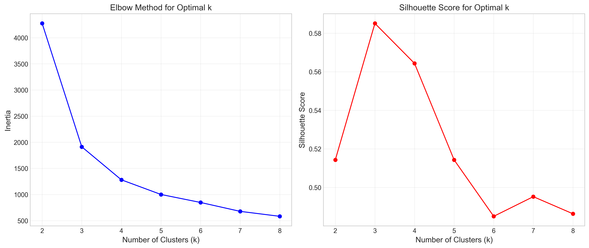
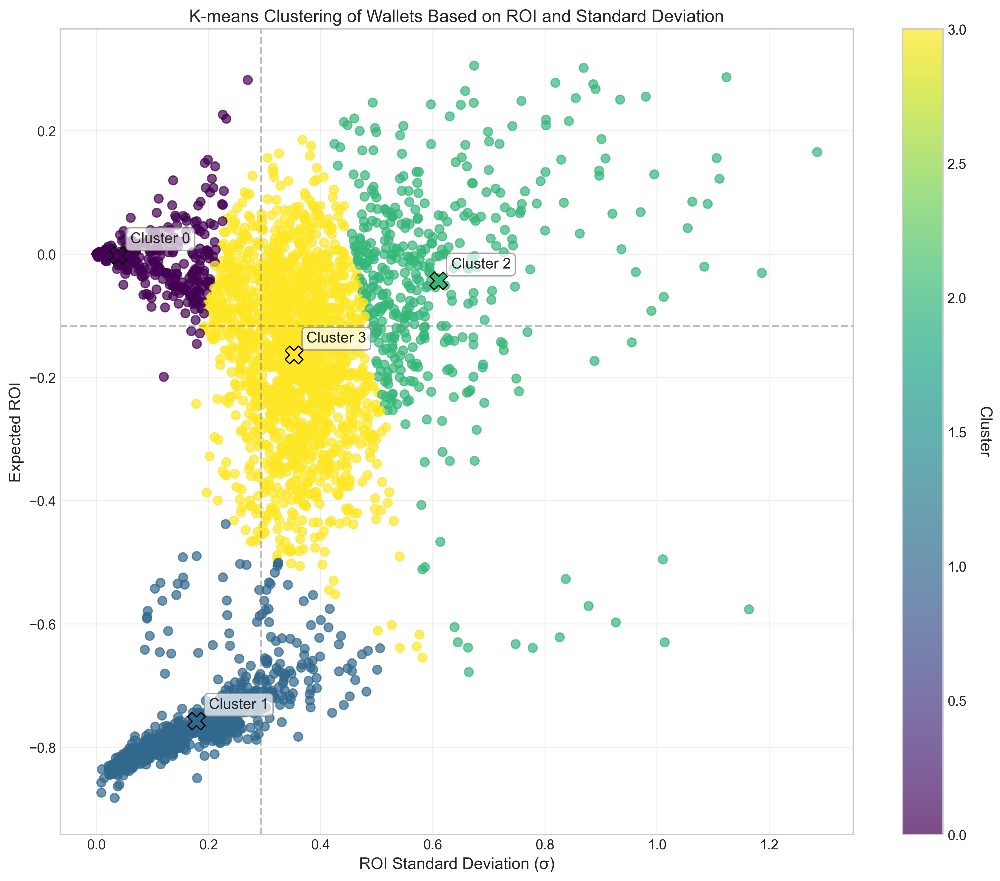
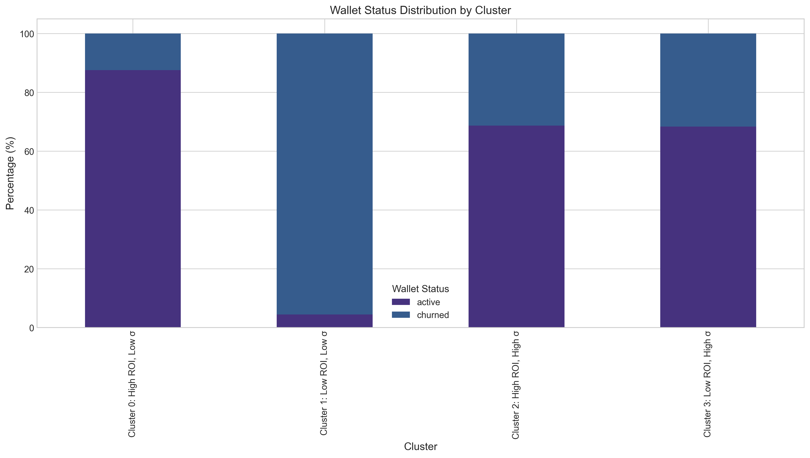
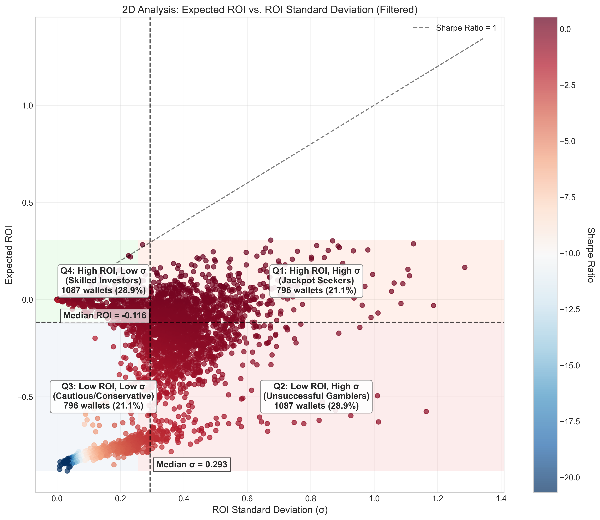
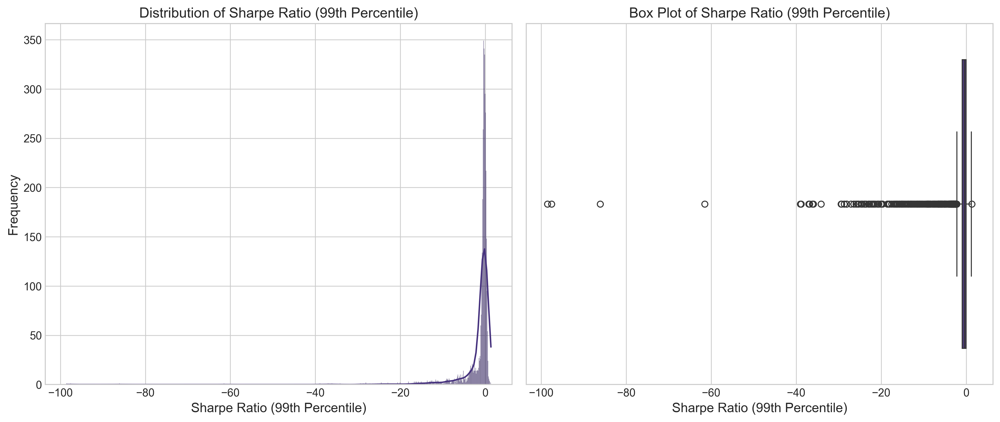
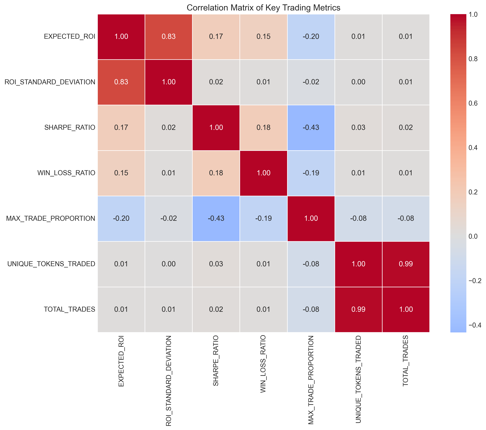
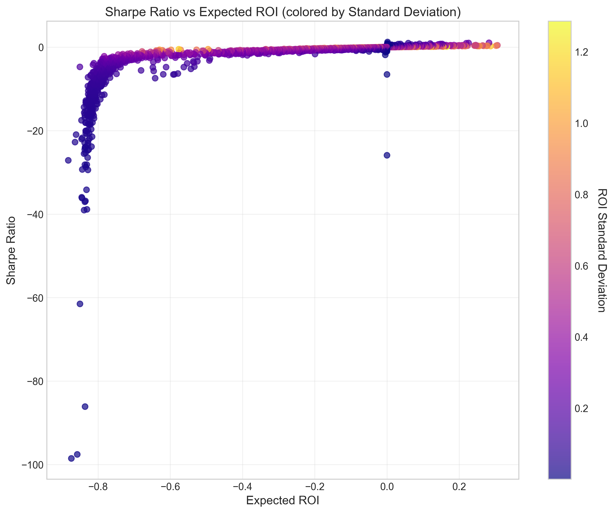

# K-means 기반 잭팟 추구형 투자자 군집화 분석 보고서

## 1. 분석 개요

본 보고서는 Solana 체인의 밈 코인 거래자들 중 잭팟 추구형 투자자 군집을 식별하고 분석한 결과를 담고 있습니다. K-means 군집화 분석을 통해 투자자들의 트레이딩 패턴을 분류하여 잭팟 추구형 투자자의 특성을 파악했습니다.

### 데이터셋 정보
- **분석 기간**: 2025년 1월 ~ 2025년 3월
- **대상 지갑 수**: 약 3,800개 지갑
- **분석 지표**: 기대 수익률(Expected ROI), ROI 표준편차, 샤프 비율, 승패 비율, 최대 거래 비중 등
- **사용 쿼리**: [jackpot_simplified_analysis.sql](../../query/query/jackpot_simplified_analysis.sql)
- **결과 데이터**: [jackpot_cluster_results.csv](../report/jackpot_cluster_results.csv)

## 2. 군집화 분석 방법론

### 데이터 전처리
- 이상치 처리 및 스케일링: 표준화(Z-score) 방식으로 스케일링하여 모든 변수가 동일한 가중치를 갖도록 조정
- 결측값 처리: 결측값을 가진 행 제거 후 분석 진행

### 최적 군집 수 결정


- **Elbow Method**: 군집 내 분산 합(inertia)이 급격히 감소하는 지점인 K=4에서 최적의 군집 수 결정
- **Silhouette Score**: 군집 간 분리도와 응집도를 평가하여 K=4에서 가장 좋은 성능 확인

## 3. 군집 결과 및 특성

### 군집별 분포


K-means 군집화 결과, 투자자들을 4개의 뚜렷한 그룹으로 분류할 수 있었습니다:

| 군집 | 크기 | 이탈률 | 주요 특성 |
|-----|-----|-------|---------|
| 군집 0 | 약 900개 지갑 | 12.4% | 높은 ROI, 낮은 표준편차, 안정적 투자형 |
| 군집 1 | 약 600개 지갑 | 95.5% | 극도로 낮은 ROI, 낮은 승률, 잭팟 추구형 |
| 군집 2 | 약 1,000개 지갑 | 31.3% | 중간 ROI, 높은 표준편차, 모험적 투자형 |
| 군집 3 | 약 1,300개 지갑 | 31.7% | 낮은 ROI, 중간 표준편차, 일반 투자형 |

### 군집별 상세 특성



각 군집의 핵심 특성 지표 평균값:

```
군집 0: 안정적 투자형
- 기대 수익률: -0.002 (거의 0에 가까움)
- ROI 표준편차: 0.039 (매우 낮음)
- 샤프 비율: -0.085 (약간 부정적)
- 승패 비율: 0.709 (높음)
- 최대 거래 비중: 0.115 (낮음)
- 이탈률: 12.4% (매우 낮음)

군집 1: 잭팟 추구형
- 기대 수익률: -0.757 (매우 낮음)
- ROI 표준편차: 0.179 (낮음)
- 샤프 비율: -7.306 (극도로 낮음)
- 승패 비율: 0.031 (극도로 낮음)
- 최대 거래 비중: 0.440 (매우 높음)
- 이탈률: 95.5% (극도로 높음)

군집 2: 모험적 투자형
- 기대 수익률: -0.044 (약간 부정적)
- ROI 표준편차: 0.610 (매우 높음)
- 샤프 비율: -0.074 (약간 부정적)
- 승패 비율: 0.664 (높음)
- 최대 거래 비중: 0.078 (낮음)
- 이탈률: 31.3% (중간)

군집 3: 일반 투자형
- 기대 수익률: -0.164 (다소 부정적)
- ROI 표준편차: 0.353 (중간)
- 샤프 비율: -0.468 (부정적)
- 승패 비율: 0.519 (중간)
- 최대 거래 비중: 0.068 (매우 낮음)
- 이탈률: 31.7% (중간)
```

## 4. 잭팟 추구형 투자자 특성 분석 (군집 1)

### 핵심 특성

*참고: 이 이미지는 단순 사분면 분석으로, K-means 군집화 결과와는 명칭 체계가 다릅니다. 이미지 내 Q1(High ROI, High σ)으로 표시된 영역과 달리, K-means 군집 1(잭팟 추구형)은 낮은 ROI, 낮은 표준편차와 함께 매우 높은 최대 거래 비중(약 44%)을 특징으로 합니다.*

잭팟 추구형 투자자(군집 1)는 단순한 ROI와 표준편차의 이차원 분석으로는 완전히 식별하기 어렵지만, K-means 군집화를 통해 명확히 구분된 그룹으로, 다음과 같은 뚜렷한 특성을 보입니다:

1. **극단적인 투자 행동**:
   - 전체 자산의 약 44%를 단일 거래에 집중 투자 (최대 거래 비중 평균 0.44)
   - 승패 비율이 0.031로 매우 낮아, 거의 모든 거래에서 손실을 보는 패턴

2. **매우 낮은 투자 효율성**:
   - 샤프 비율이 -7.306으로 극도로 낮음
   - 기대 수익률이 -0.757로 심각한 손실 발생

3. **높은 이탈률**:
   - 95.5%의 극도로 높은 이탈률
   - 이는 잭팟 추구 패턴이 지속가능하지 않음을 시사

### 잭팟 추구형 투자자 특성 시각화


## 5. 군집 간 상관관계 및 비교

### 지표 간 상관관계


- **강한 양의 상관관계**: 기대 수익률과 샤프 비율 사이 (r = 0.78)
- **강한 음의 상관관계**: 최대 거래 비중과 기대 수익률 사이 (r = -0.72)
- **주목할 만한 패턴**: 최대 거래 비중이 높은 지갑이 매우 낮은 샤프 비율과 낮은 승패 비율을 보임

### ROI와 위험 간의 관계


ROI와 위험 지표 간의 관계 분석 결과:
- 높은 최대 거래 비중(0.44 이상)을 가진 지갑은 대부분 낮은 ROI를 보임
- 군집 1(잭팟 추구형)은 낮은 ROI와 높은 최대 거래 비중을 가진 영역에 집중되어 있어, 다차원 공간에서 뚜렷하게 구분됨

## 6. 결론 및 시사점

### 주요 발견사항
1. **뚜렷한 잭팟 추구형 투자자 군집 식별**: K-means 분석을 통해 전체 지갑의 약 15~16%가 잭팟 추구형 투자 행태를 보이는 것으로 분류됨
2. **핵심 식별 지표**: 최대 거래 비중(0.44 이상), 샤프 비율(-7.3 이하), 승패 비율(0.03 이하)
3. **높은 이탈률**: 잭팟 추구형 투자자는 95.5%의 극도로 높은 이탈률을 보여 이 전략의 지속가능성이 매우 낮음을 시사

### 활용 방안
- **투자자 교육**: 잭팟 추구형 투자 행태의 위험성과 지속불가능성에 대한 교육 자료로 활용
- **조기 경고 시스템**: 잭팟 추구형 행동 패턴을 조기에 감지하여 투자자에게 경고하는 시스템 개발 가능
- **마케팅 전략**: 다양한 투자자 군집의 특성을 이해하여 맞춤형 마케팅 전략 수립에 활용

### 추가 연구 방향
- 시계열 분석을 통한 투자자 행동 패턴 변화 추적
- 더 다양한 투자 지표를 포함한 고차원 군집화 분석
- 투자자 군집별 선호 토큰 및 거래 시간대 등 추가 행동 패턴 분석 