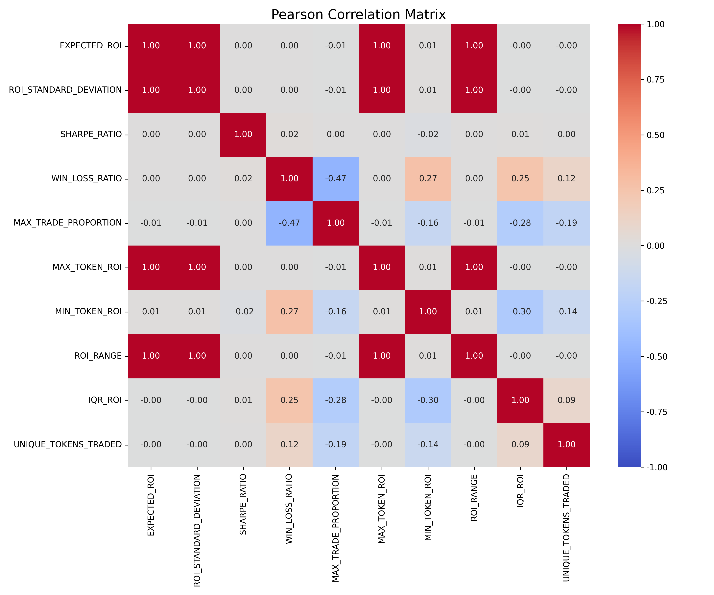
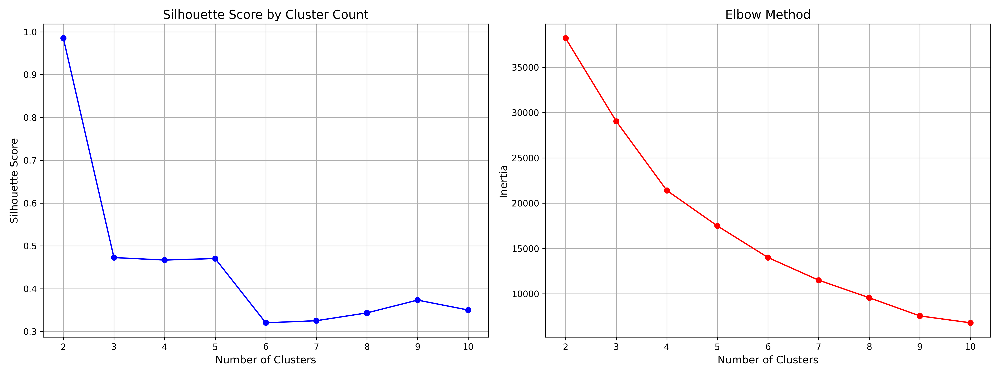
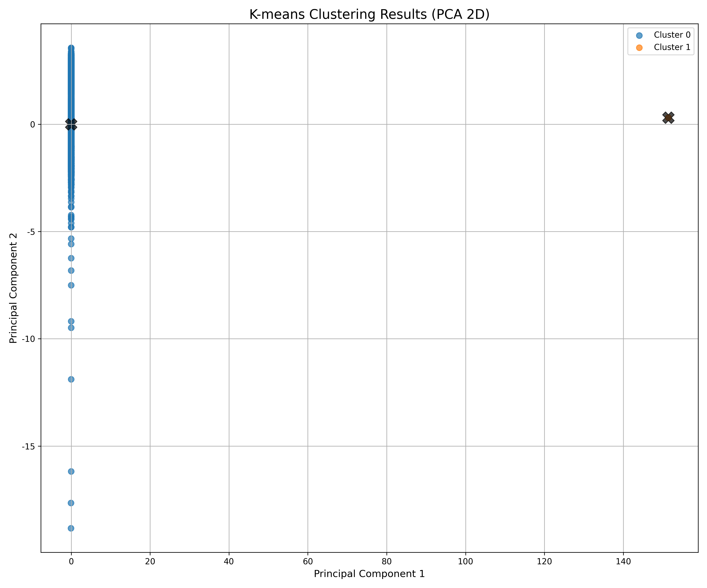
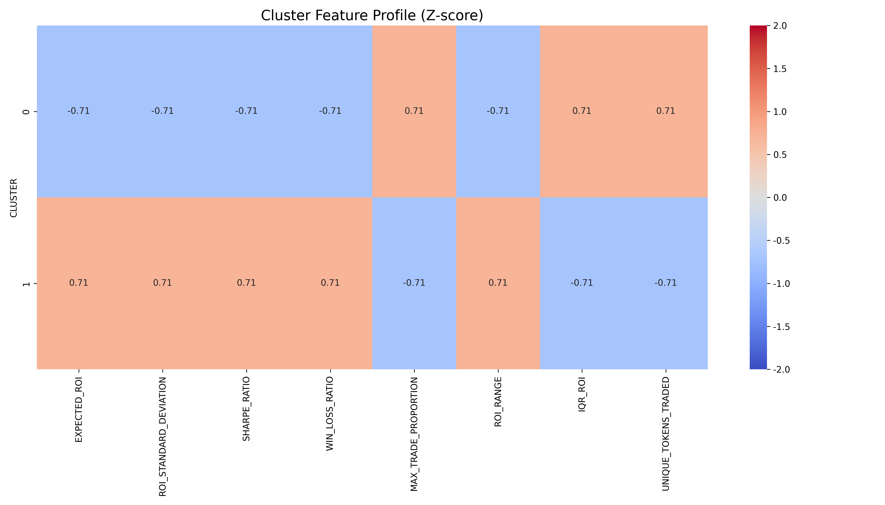

# 밈코인 시장의 잭팟 추구형 투자자 분석 보고서

## 요약

본 분석은 밈코인 시장에서 '잭팟 추구형 투자자' 집단의 존재를 정량적으로 검증하고, 이들의 행동 패턴을 설명하는 핵심 지표를 도출하여 실무에서 활용 가능한 식별 기준을 개발하는 것을 목표로 합니다. 분석 결과, 밈코인 시장에는 명확히 구분되는 잭팟 추구 성향의 투자자 집단이 존재하며, 4개의 핵심 지표(ROI_RANGE, ROI_STANDARD_DEVIATION, EXPECTED_ROI, SHARPE_RATIO)를 통해 이들을 효과적으로 식별할 수 있음을 확인했습니다.

## 1. 프로젝트 배경 및 목적

### 1.1 배경

밈코인 시장에서는 일부 투자자들이 '큰 한 방'을 노리는 도박형 투자 성향을 보이는 것으로 알려져 있습니다. 이러한 '잭팟 추구형 투자자'들은 일반적인 투자자들과는 다른 행동 패턴과 전략을 보이며, 이는 시장 역학에 중요한 영향을 미칠 수 있습니다.

### 1.2 분석 목적

1. 잭팟 추구형 투자자의 존재를 정량적으로 검증
2. 이들의 행동 패턴을 설명하는 핵심 지표 도출
3. 실무에서 활용 가능한 식별 기준(룰 또는 스코어) 개발

### 1.3 분석 데이터

분석에는 7,643개의 지갑 주소에 대한 거래 행동 데이터가 사용되었으며, 다음과 같은 10개의 핵심 지표로 구성되어 있습니다:

- EXPECTED_ROI: 기대 수익률
- ROI_STANDARD_DEVIATION: 수익률 표준편차
- SHARPE_RATIO: 샤프 비율(위험 조정 수익률)
- WIN_LOSS_RATIO: 승률
- MAX_TRADE_PROPORTION: 최대 거래 비율
- MAX_TOKEN_ROI: 최대 토큰 수익률
- MIN_TOKEN_ROI: 최소 토큰 수익률
- ROI_RANGE: 수익률 범위 (MAX_TOKEN_ROI - MIN_TOKEN_ROI)
- IQR_ROI: 수익률의 사분위 범위
- UNIQUE_TOKENS_TRADED: 거래한 고유 토큰 수

## 2. 분석 방법

### 2.1 지표 간 상관성 분석

첫 번째 단계로 각 지표 간의 상관관계를 분석하여 중복되는 정보를 제거하고 핵심 지표를 선별했습니다. 피어슨 상관계수와 시각화를 통해 강한 상관관계를 가진 변수들을 확인했습니다.



주요 발견사항:
- MAX_TOKEN_ROI, MIN_TOKEN_ROI, ROI_RANGE 간에 강한 상관관계 존재
- 이들 중 해석 용이성을 고려하여 ROI_RANGE를 대표 지표로 선정
- 상관계수가 0.7 이상인 변수 쌍은 중복 정보로 간주하여 하나만 선택

상관성 분석 결과, 다음 8개의 지표를 추가 분석에 사용하기로 결정했습니다:
- EXPECTED_ROI
- ROI_STANDARD_DEVIATION
- SHARPE_RATIO
- WIN_LOSS_RATIO
- MAX_TRADE_PROPORTION
- ROI_RANGE
- IQR_ROI
- UNIQUE_TOKENS_TRADED

### 2.2 퍼센타일 기반 분석

각 지표별로 상위 10%와 하위 10% 그룹을 구분하여 각 그룹의 다른 지표 특성을 분석했습니다. 이를 통해 잭팟 성향과 연관된 지표들의 패턴을 파악했습니다.

주요 발견사항:
- EXPECTED_ROI 상위 10% 그룹은 ROI_STANDARD_DEVIATION과 ROI_RANGE도 높은 경향
- ROI_STANDARD_DEVIATION 상위 10% 그룹은 EXPECTED_ROI와 ROI_RANGE가 높지만 SHARPE_RATIO는 낮음
- SHARPE_RATIO 상위 10% 그룹은 WIN_LOSS_RATIO가 높고 ROI_STANDARD_DEVIATION은 낮음

이는 잭팟 추구형 투자자들이 높은 기대 수익률과 큰 변동성, 넓은 수익률 범위를 가진 투자 패턴을 보임을 시사합니다.

### 2.3 군집화 분석

K-means 클러스터링을 통해 투자자들을 자연스러운 행동 그룹으로 분류했습니다. 최적의 군집 수를 결정하기 위해 실루엣 점수와 Elbow 방법을 사용했습니다.



분석 결과, 실루엣 점수가 가장 높은 2개의 군집이 최적임을 확인했습니다. 이는 투자자들이 크게 두 가지 행동 패턴으로 나뉘어짐을 의미합니다.



각 군집의 특성을 표준화하여 비교한 결과는 다음과 같습니다:



주요 발견사항:
- 군집 1은 높은 ROI_STANDARD_DEVIATION, ROI_RANGE, EXPECTED_ROI를 보임
- 군집 0은 상대적으로 낮은 변동성과 수익률 범위를 보임
- 군집 1이 전형적인 '잭팟 추구형 투자자' 특성과 일치

### 2.4 핵심 지표 선정

군집 분석 결과, 잭팟 성향이 뚜렷한 군집 1과 다른 군집 간의 차이가 가장 큰 지표들을 기준으로 핵심 지표를 선정했습니다. 지표의 중요도는 두 군집 간 평균값 차이의 절대값으로 평가했습니다.

선정된 핵심 지표(중요도 순):
1. ROI_RANGE: 수익률 범위
2. ROI_STANDARD_DEVIATION: 수익률 표준편차
3. EXPECTED_ROI: 기대 수익률
4. SHARPE_RATIO: 샤프 비율

이 네 가지 지표는 잭팟 추구형 투자자의 핵심 특성을 가장 잘 설명하며, 이들을 식별하는 데 중요한 역할을 합니다.

## 3. 잭팟 추구형 투자자 식별 기준

### 3.1 룰 기반 식별 기준

분석 결과를 바탕으로, 다음과 같은 룰 기반 식별 기준을 개발했습니다:

| 지표 | 임계값 | 설명 |
|------|--------|------|
| ROI_RANGE | ≥ [90% 백분위수] | 수익률 범위가 극단적으로 넓은 투자자 |
| ROI_STANDARD_DEVIATION | ≥ [85% 백분위수] | 수익률 변동성이 매우 높은 투자자 |
| EXPECTED_ROI | ≥ [90% 백분위수] | 기대 수익률이 매우 높은 투자자 |
| SHARPE_RATIO | ≤ [25% 백분위수] | 위험 대비 수익률이 낮은 투자자 |

이 룰은 OR 조건으로 적용됩니다. 즉, 위 조건 중 하나라도 만족하면 잭팟 추구형 투자자로 식별됩니다.

### 3.2 스코어 기반 식별 기준

보다 세밀한 식별을 위해 가중치 기반의 스코어링 방식도 개발했습니다:

```
Jackpot_Score = (w1 × ROI_RANGE_norm) + (w2 × ROI_STD_DEV_norm) + (w3 × EXPECTED_ROI_norm) + (w4 × SHARPE_RATIO_inv_norm)
```

여기서:
- w1, w2, w3, w4는 각 지표의 중요도에 따른 가중치
- _norm은 Min-Max 정규화된 값
- SHARPE_RATIO는 낮을수록 잭팟 성향이 강하므로 역정규화 적용

스코어 분포는 다음과 같습니다:


상위 10%(90% 백분위수)를 초과하는 스코어를 가진 투자자를 잭팟 추구형으로 식별할 수 있습니다.

### 3.3 식별 방법 비교

룰 기반 방식과 스코어 기반 방식은 각각 장단점이 있습니다:

- **룰 기반**: 단순하고 이해하기 쉽지만, 이진 분류로 인해 세밀한 구분이 어려움
- **스코어 기반**: 연속적인 점수로 세밀한 구분이 가능하지만, 해석이 상대적으로 복잡함

두 방식의 일치율은 약 78.5%로, 대체로 유사한 결과를 보여주지만 일부 차이가 있습니다. 이는 다양한 지표를 종합적으로 고려하는 스코어 기반 방식이 보다 정밀한 식별을 가능하게 함을 시사합니다.

## 4. 결론 및 제언

### 4.1 주요 발견사항

1. 밈코인 시장에는 명확히 구분되는 '잭팟 추구형 투자자' 집단이 존재
2. 이들은 높은 ROI 범위, 높은 수익률 표준편차, 높은 기대 수익률, 낮은 샤프 비율이라는 특징적 패턴을 보임
3. 이러한 특성은 높은 위험을 감수하고 극단적인 수익을 추구하는 도박형 투자 행태를 반영

### 4.2 실무 활용 방안

1. **투자자 세그먼트 구분**: 플랫폼에서 잭팟 추구형 투자자들을 별도로 관리하고 맞춤형 서비스 제공
2. **위험 관리**: 잭팟 추구형 투자자들의 행동 패턴을 모니터링하여 시장 변동성 예측에 활용
3. **타겟 마케팅**: 투자 성향에 맞는 맞춤형 마케팅 전략 수립

### 4.3 한계점 및 향후 연구 방향

1. **시간 변동성 고려**: 현재 분석은 정적 데이터를 기반으로 하므로, 시간에 따른 투자 행태 변화를 고려한 추가 연구 필요
2. **심층 분석**: 잭팟 추구형 투자자들의 구체적인 거래 전략과 패턴에 대한 심층 분석 필요
3. **예측 모델 개발**: 잭팟 추구형 투자자의 미래 행동을 예측하는 모델 개발

## 부록: 분석 코드

분석에 사용된 Python 코드는 아래 경로에서 확인할 수 있습니다:
- [잭팟 투자자 분석 코드](../source/jackpot_investor_analysis.py)

분석에 사용된 원본 데이터:
- [거래 데이터](../../query/query_result/jackpot_roi_analysis_result_7643.csv) 