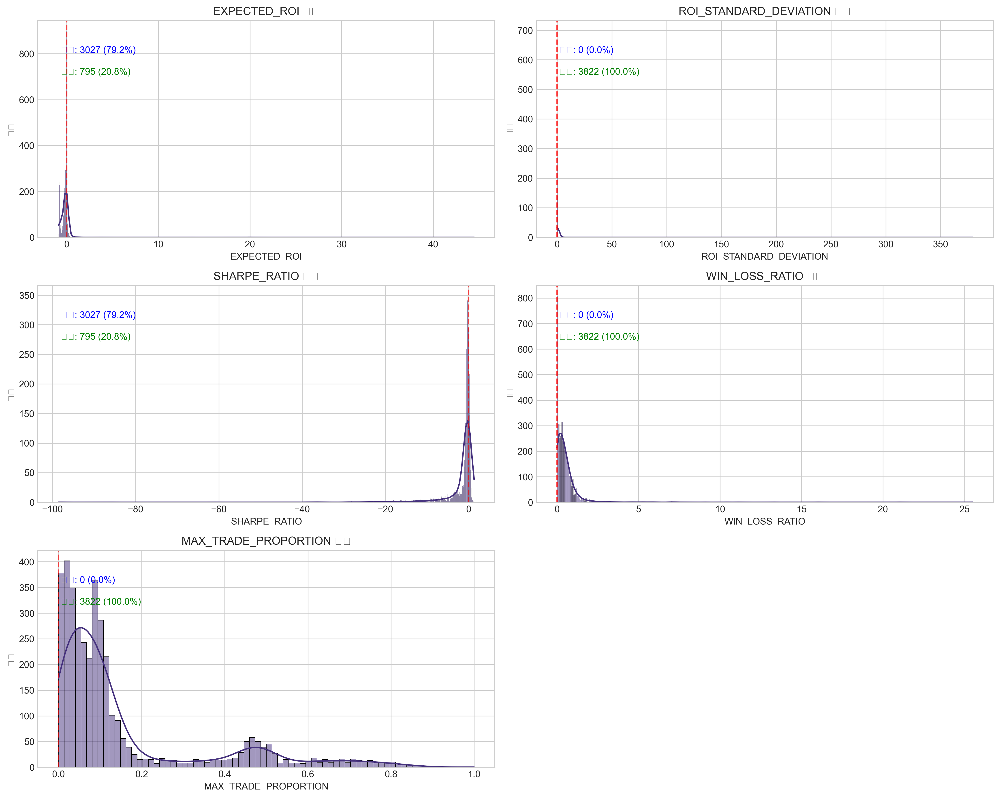

# 1단계: 데이터 준비 및 이상치 점검 보고서

## 1. 요약 (Executive Summary)

- 총 3823개의 지갑 데이터에 대해 5개 핵심 지표 분석 완료
- 결측치는 발견되었으며(6개), 해당 행 제거 처리됨
- SHARPE_RATIO(17.1%)와 MAX_TRADE_PROPORTION(17.9%)에서 특히 높은 비율의 이상치 발견
- 데이터 안정성을 위해 상하위 1% 윈저라이징을 적용하여 극단값 영향 완화
- 음수값(특히 EXPECTED_ROI, SHARPE_RATIO)은 유효한 금융 지표이므로 변환 없이 유지
- 최종 데이터는 표준화(Standardization)되어 PCA 분석 준비 완료

## 2. 데이터 품질 분석

### 결측치 분석:

| 변수 | 결측치 수 | 결측치 비율(%) |
| --- | --- | --- |
| SWAPPER | 0 | 0.0 |
| WALLET_STATUS | 1 | 0.03 |
| EXPECTED_ROI | 1 | 0.03 |
| ROI_STANDARD_DEVIATION | 1 | 0.03 |
| SHARPE_RATIO | 1 | 0.03 |
| WIN_LOSS_RATIO | 1 | 0.03 |
| MAX_TRADE_PROPORTION | 1 | 0.03 |

**결론**: 결측치가 있는 행(6개)을 제거하여 처리완료

### 데이터 타입 확인:

| 변수 | 데이터 타입 |
| --- | --- |
| SWAPPER | object |
| WALLET_STATUS | object |
| EXPECTED_ROI | float64 |
| ROI_STANDARD_DEVIATION | float64 |
| SHARPE_RATIO | float64 |
| WIN_LOSS_RATIO | float64 |
| MAX_TRADE_PROPORTION | float64 |

**결론**: 모든 핵심 지표가 적절한 숫자형(float64)으로 확인됨

## 3. 이상치 분석 및 처리

### 주요 이상치 통계:

| 변수 | 이상치 수 | 이상치 비율(%) |
| --- | --- | --- |
| EXPECTED_ROI | 33 | 0.8634222919937204 |
| ROI_STANDARD_DEVIATION | 90 | 2.3547880690737837 |
| SHARPE_RATIO | 655 | 17.137624280481422 |
| WIN_LOSS_RATIO | 175 | 4.5787545787545785 |
| MAX_TRADE_PROPORTION | 683 | 17.870225013082155 |

**주요 인사이트**: 
- SHARPE_RATIO(17.1%)와 MAX_TRADE_PROPORTION(17.9%)에서 특히 높은 비율의 이상치가 관찰됨 
- 두 변수 모두 전체 데이터의 약 1/6이 이상치로 식별됨
- 반면, EXPECTED_ROI는 상대적으로 이상치 비율이 낮음(0.86%)

**이상치 처리 방법**: 상하위 1% 윈저라이징(Winsorizing)을 적용하여 극단값의 영향을 완화하면서도 데이터 포인트를 유지함
- 윈저라이징 1%는 각 변수의 상위 1% 값을 99번째 백분위수로, 하위 1% 값을 1번째 백분위수로 대체하는 방법
- 특히 17% 이상의 높은 이상치 비율을 보인 변수들의 경우, 완전히 제거하면 너무 많은 데이터가 손실되기 때문에 윈저라이징이 적절한 대안으로 선택됨

### 핵심 시각화:

주요 관찰: EXPECTED_ROI와 SHARPE_RATIO는 음수 값이 많음 (약 79.2%)

## 4. 최종 데이터셋 요약

### 처리 전/후 비교 통계:

| 변수 | 원본 평균 | 윈저라이징 후 평균 | 원본 표준편차 | 윈저라이징 후 표준편차 |
| --- | --- | --- | --- | --- |
| EXPECTED_ROI | -0.17947320294435046 | -0.22243851287493263 | 1.1120473927236545 | 0.29538697989113777 |
| ROI_STANDARD_DEVIATION | 0.5703359383421193 | 0.28600570439620393 | 8.495331108085713 | 0.2277724868156509 |
| SHARPE_RATIO | -1.6478111862444467 | -1.5235781991733424 | 4.692492441472351 | 3.445312470336787 |
| WIN_LOSS_RATIO | 0.49983740450026165 | 0.45719654735740456 | 0.9465574408184602 | 0.5040818142535778 |
| MAX_TRADE_PROPORTION | 0.15410686165419607 | 0.15368622220132316 | 0.1931839640064671 | 0.19167068776027402 |

**주요 변화점**:
- ROI_STANDARD_DEVIATION의 표준편차가 가장 크게 감소함 (8.495 → 0.228, 97.3% 감소)
- EXPECTED_ROI의 표준편차도 크게 감소함 (1.112 → 0.295, 73.5% 감소)
- 윈저라이징 후 모든 변수의 분포가 더 안정적이고 예측 가능한 형태로 변환됨
- 특히 이상치 비율이 높았던 SHARPE_RATIO와 MAX_TRADE_PROPORTION의 경우, 상하위 극단값이 조정되어 더 균형잡힌 분포로 변환됨

**표준화 준비 상태**: StandardScaler를 사용하여 각 변수의 평균 0, 표준편차 1로 변환 완료

## 5. 참조 파일 목록

| 단계 | 파일명 | 내용 설명 |
|------|-------|----------|
| 1.3 | missing_values_analysis.csv | 결측치 분석 결과 |
| 1.4 | data_types.csv | 데이터 타입 확인 결과 |
| 1.5 | basic_statistics.csv | 기본 통계량 분석 결과 |
| 1.6 | distributions_histograms.png | 각 변수별 분포 히스토그램 |
| 1.6 | boxplots.png | 각 변수별 박스플롯 |
| 1.6 | correlation_heatmap.png | 변수 간 상관관계 히트맵 |
| 1.6 | correlation_matrix.csv | 상관관계 행렬 |
| 1.7 | outliers_summary.csv | 이상치 식별 결과 |
| 1.8 | winsorized_comparison.csv | 윈저라이징 전후 통계 비교 |
| 1.8 | winsorized_comparison_plot.png | 윈저라이징 전후 분포 비교 |
| 1.9 | winsorized_data.csv | 윈저라이징 적용된 데이터셋 |
| 1.9 | scaled_data.csv | 표준화된 최종 데이터셋 |
| 1.9 | scaled_data_statistics.csv | 표준화된 데이터 통계량 |

