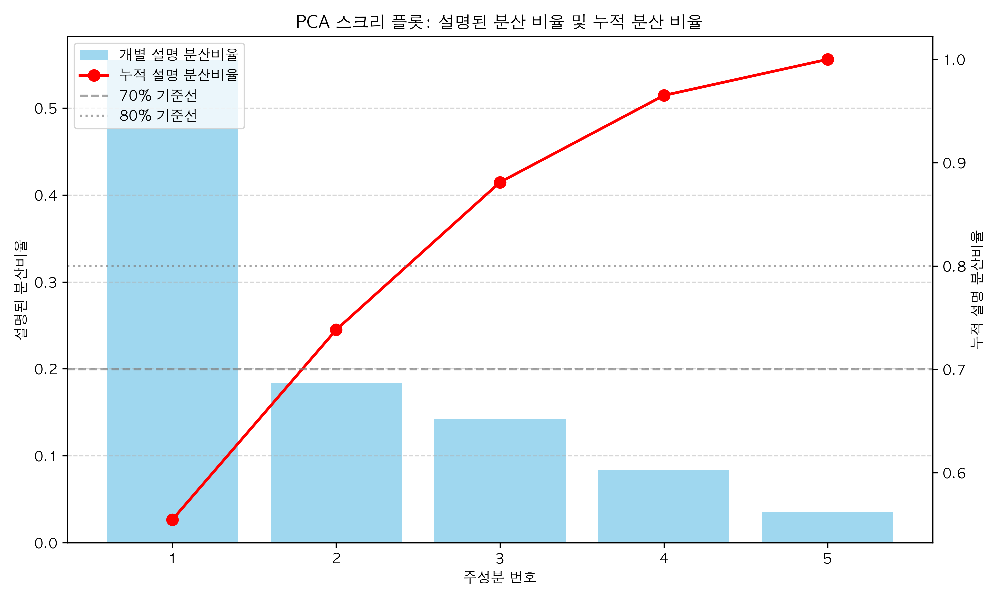
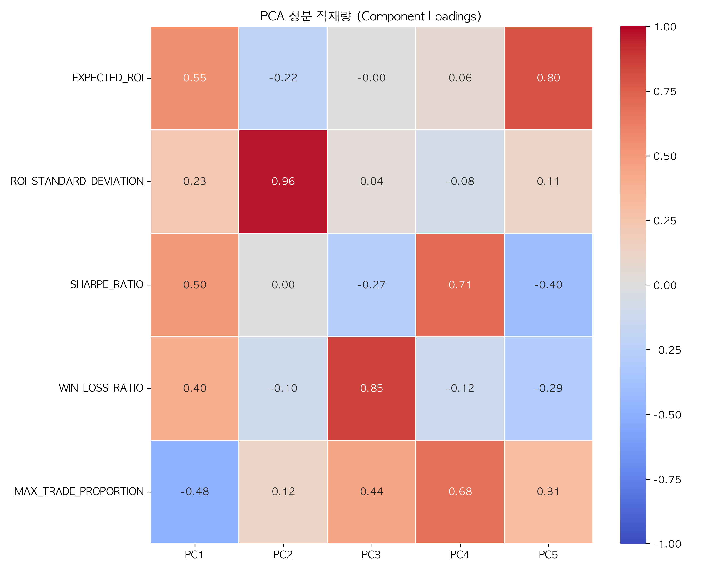
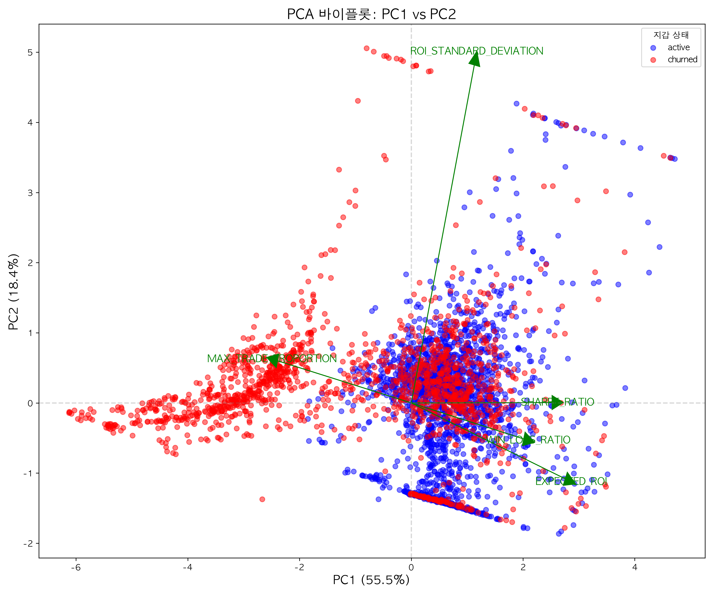
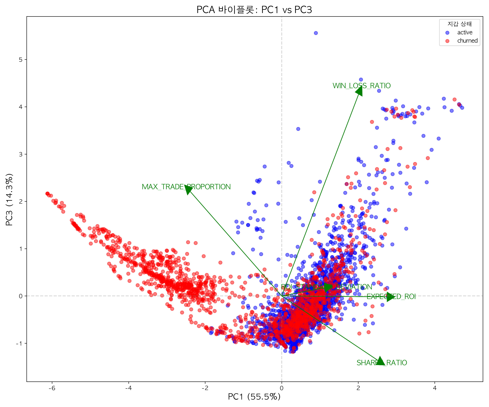
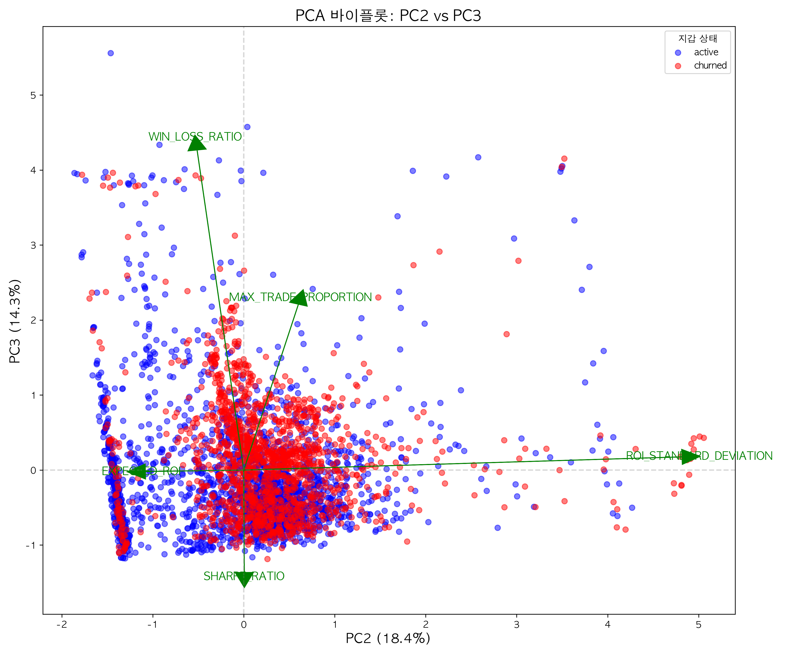

# PCA 분석 보고서

## 1. 개요 (Executive Summary)

본 분석은 투자자 지갑 데이터의 5개 핵심 지표(EXPECTED_ROI, ROI_STANDARD_DEVIATION, SHARPE_RATIO, WIN_LOSS_RATIO, MAX_TRADE_PROPORTION)에 대한 주성분 분석(PCA)을 수행하였습니다. 총 3,822개의 지갑 데이터가 분석에 사용되었으며, 차원 축소를 통해 데이터의 패턴과 구조를 파악하고자 했습니다.

### 주요 발견사항:

- 첫 2개의 주성분(PC1, PC2)이 전체 분산의 약 74%를 설명
- 첫 3개의 주성분(PC1, PC2, PC3)은 전체 분산의 약 88%를 설명
- PC1은 전반적인 투자 성과와 수익성을 나타내는 축으로 해석됨 (전체 분산의 55.5% 설명)
- PC2는 투자 변동성(위험)을 나타내는 축으로 해석됨 (전체 분산의 18.4% 설명)
- PC3은 수익 대비 위험 및 승패 비율의 특성을 나타내는 축으로 해석됨 (전체 분산의 14.3% 설명)

## 2. PCA 분석 결과

### 2.1 주성분 추출

PCA 분석 결과, 5개의 주성분이 도출되었습니다. 각 주성분의 고유값(eigenvalue)과 설명된 분산 비율은 다음과 같습니다:

| 주성분 | 고유값 | 설명된 분산 비율 | 누적 분산 비율 |
|--------|----------|----------------------|------------------------|
| PC1    | 2.7737   | 55.46%              | 55.46%                 |
| PC2    | 0.9188   | 18.37%              | 73.83%                 |
| PC3    | 0.7142   | 14.28%              | 88.11%                 |
| PC4    | 0.4199   | 8.40%               | 96.51%                 |
| PC5    | 0.1747   | 3.49%               | 100.00%                |

Kaiser 기준(고유값 > 1)에 의하면 PC1만 선택해야 하지만, 누적 설명 분산 비율을 고려할 때 PC1과 PC2를 선택하는 것이 적절합니다. 첫 두 개의 주성분만으로 전체 분산의 약 74%를 설명하며, PC3까지 포함하면 약 88%의 분산을 설명합니다.

### 2.2 주성분 적재량 분석

각 변수가 주성분에 미치는 영향을 나타내는 적재량(loading) 분석 결과는 다음과 같습니다:

| 변수                  | PC1       | PC2       | PC3       | PC4       | PC5       |
|-----------------------|-----------|-----------|-----------|-----------|-----------|
| EXPECTED_ROI          | 0.551     | -0.216    | -0.004    | 0.063     | 0.803     |
| ROI_STANDARD_DEVIATION| 0.226     | 0.963     | 0.035     | -0.085    | 0.111     |
| SHARPE_RATIO          | 0.504     | 0.001     | -0.273    | 0.714     | -0.403    |
| WIN_LOSS_RATIO        | 0.403     | -0.103    | 0.854     | -0.121    | -0.290    |
| MAX_TRADE_PROPORTION  | -0.479    | 0.120     | 0.442     | 0.682     | 0.310     |

### 2.3 주성분 특성 해석

각 주성분의 특성을 해석하면 다음과 같습니다:

#### PC1 (55.46%): "투자 성과 축"

- **높은 양의 적재량**: EXPECTED_ROI(0.551), SHARPE_RATIO(0.504), WIN_LOSS_RATIO(0.403)
- **높은 음의 적재량**: MAX_TRADE_PROPORTION(-0.479)
- **해석**: 전반적인 투자 성과와 수익성을 나타내는 축입니다. PC1 값이 높을수록 기대 수익률, 샤프 비율, 승패 비율이 높고, 최대 거래 비중은 낮은 경향이 있습니다. 따라서 PC1이 높은 투자자는 분산 투자를 통해 높은 성과를 내는 합리적 투자자로 해석할 수 있습니다.

#### PC2 (18.37%): "투자 변동성 축"

- **높은 양의 적재량**: ROI_STANDARD_DEVIATION(0.963)
- **해석**: 수익률의 변동성(위험)을 나타내는 축입니다. PC2 값이 높을수록 투자 수익의 표준편차가 높아, 수익의 변동성이 큰 투자자입니다. 이는 높은 위험을 감수하는 투자 성향을 나타냅니다.

#### PC3 (14.28%): "투자 전략 축"

- **높은 양의 적재량**: WIN_LOSS_RATIO(0.854), MAX_TRADE_PROPORTION(0.442)
- **높은 음의 적재량**: SHARPE_RATIO(-0.273)
- **해석**: 투자 전략적 성향을 나타내는 축입니다. 양(+) 방향은 승률을 높이는 데 집중하지만 위험 관리(Sharpe)는 떨어지는 공격적 투자를 의미합니다. 음(-) 방향은 승률이 낮고 분산 투자 경향이 있지만, Sharpe는 상대적으로 양호할 가능성이 있는 안정적 투자를 나타냅니다.

## 3. 차원 축소 결과

### 3.1 차원 축소 효과

원래 5차원이었던 데이터를 2~3차원으로 축소하는 데 성공했습니다. 이 과정에서:

- 2차원(PC1, PC2)으로 축소 시 약 26%의
- 3차원(PC1, PC2, PC3)으로 축소 시 약 12%의 정보 손실이 있습니다.

하지만 이러한 정보 손실보다 차원 축소를 통한 해석 가능성의 증가가 더 큰 이점으로 판단됩니다.

### 3.2 PC 공간에서의 데이터 분포

위 바이플롯을 통해 다음과 같은 인사이트를 얻을 수 있습니다:

1. **투자자 분포**: PC1-PC2 공간에서 투자자들이 어떻게 분포하는지 확인할 수 있습니다. 특히 Active 상태와 Churned 상태의 투자자 간에 분포 차이가 있는지 확인할 수 있습니다.

2. **변수 관계**: 바이플롯에서 화살표 방향은 각 변수의 영향력을 나타냅니다. EXPECTED_ROI, SHARPE_RATIO, WIN_LOSS_RATIO는 유사한 방향성을 가지며 서로 양의 상관관계가 있음을 알 수 있습니다. 반면, MAX_TRADE_PROPORTION은 다른 변수들과 반대 방향으로 영향을 미칩니다.

PC1-PC3 공간에서의 분포를 보면, WIN_LOSS_RATIO와 MAX_TRADE_PROPORTION이 PC3 축에 큰 영향을 미치는 것을 확인할 수 있습니다. 이는 승패 비율과 최대 거래 비중이 PC3를 특징짓는 주요 요소임을 보여줍니다.

PC2-PC3 공간에서는 ROI_STANDARD_DEVIATION이 PC2를 주로 설명하고, WIN_LOSS_RATIO가 PC3을 주로 설명함을 확인할 수 있습니다.

## 4. 결론

PCA를 통해 5차원 투자자 데이터를 3차원으로 효과적으로 축소할 수 있었습니다. 주요 주성분들(PC1, PC2, PC3)은 각각 투자 성과, 변동성, 투자 전략 특성을 나타냅니다. 이러한 축소된 차원을 통해 투자자들의 특성과 패턴을 더 명확하게 파악할 수 있게 되었으며, 향후 군집 분석과 같은 추가 분석에 활용할 수 있는 기반이 마련되었습니다.

### 주성분 요약 테이블

| 주성분 | 설명된 분산 | 주요 변수 | 해석 |
|--------|------------|-----------|------|
| PC1 | 55.46% | ROI, SHARPE, WIN_LOSS (+) / MAX_TRADE (–) | 투자 성과 축: 분산 투자로 높은 성과를 내는 효율적 투자자 vs 집중 투자로 낮은 성과를 내는 비효율적 투자자 |
| PC2 | 18.37% | ROI_STANDARD_DEVIATION (+) | 투자 변동성 축: 수익률의 변동성(위험)이 큰 투자자와 안정적인 투자자 구분 |
| PC3 | 14.28% | WIN_LOSS, MAX_TRADE (+) / SHARPE (–) | 투자 전략 축: 승률 중심의 공격적 투자 vs 위험 관리 중심의 안정적 투자 |

## 5. 참조 파일 목록

| 단계 | 파일명 | 내용 설명 |
|------|-------|----------|
| 1.0 | scaled_data.csv | PCA 분석에 사용된 표준화된 원본 데이터셋 |
| 2.1 | pca_model_results.csv | 주성분 분석 모델 결과 (고유값, 설명된 분산 비율) |
| 2.1 | scree_plot.png | 주성분별 설명된 분산 비율 시각화 |
| 2.2 | pca_loadings.csv | 주성분 적재량 테이블 |
| 2.2 | pca_loading_heatmap.png | 주성분 적재량 히트맵 |
| 3.2 | transformed_pca_data.csv | 주성분 공간으로 변환된 데이터 |
| 3.2 | pca_biplot_pc1_pc2.png | PC1-PC2 공간의 바이플롯 |
| 3.2 | pca_biplot_pc1_pc3.png | PC1-PC3 공간의 바이플롯 |
| 3.2 | pca_biplot_pc2_pc3.png | PC2-PC3 공간의 바이플롯 | 