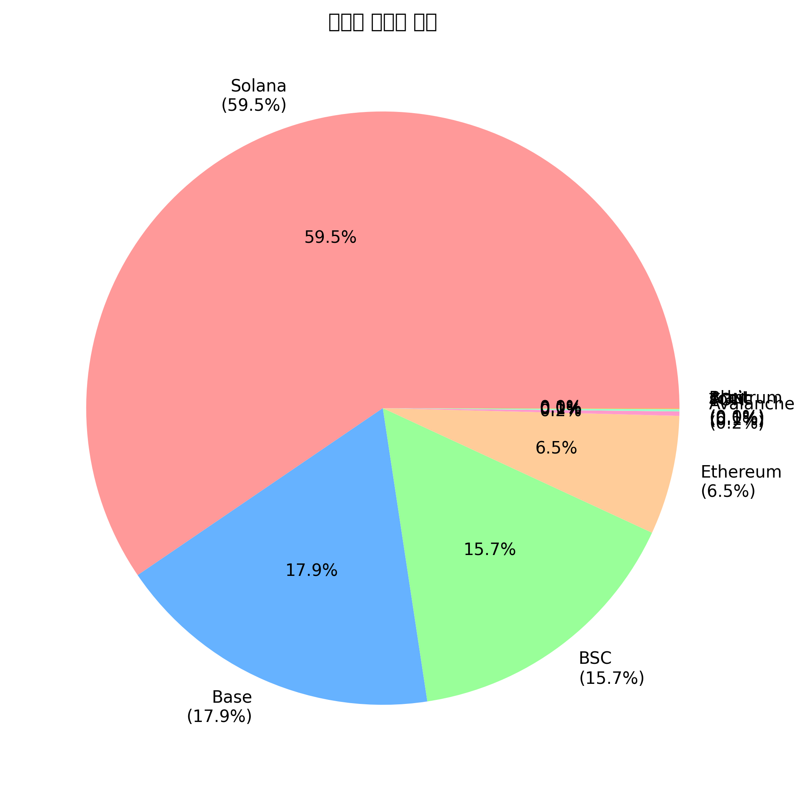
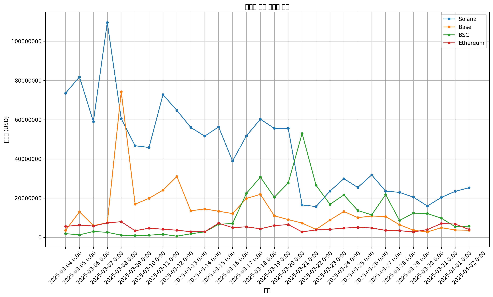
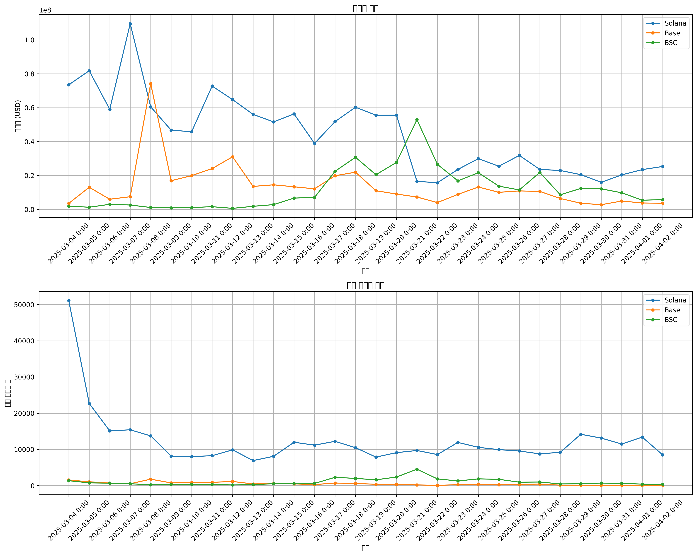

# 밈 코인 트레이딩 봇 분석
2025년 3월 4일 - 2025년 4월 2일

## 1. 분석 목적
다양한 블록체인 네트워크에서 운영되는 밈 코인 트레이딩 봇들의 거래 패턴과 사용자 행동을 분석합니다. 분석 기간은 2025년 3월 4일부터 4월 2일까지 30일입니다.

## 2. 데이터 개요
- 총 거래량: 2.24조 USD
- 총 거래 건수: 1,449만 건
- 분석 대상 블록체인: Solana, Base, BSC, Ethereum, Avalanche, Arbitrum, TON, sonic, Blast

## 3. 체인별 분석

### 3.1 거래량 분포

체인별 거래량 분포는 다음과 같습니다:
- Solana: 59.5% (1.34조 USD)
- Base: 17.9% (4,012.5억 USD)
- BSC: 15.7% (3,523억 USD)
- Ethereum: 6.5% (1,454.9억 USD)
- 기타 체인: 0.4% (146.2억 USD)

### 3.2 평균 거래 금액 분석
평균 거래 금액은 각 블록체인의 총 거래량(Total Volume)을 총 거래 건수(Total Trades)로 나누어 계산했습니다. 결과는 다음과 같습니다:

1. Avalanche: $1,047.93
   - 총 거래량: 5,324,547 USD
   - 총 거래 건수: 5,081건

2. Ethereum: $476.32
   - 총 거래량: 145,494,756 USD
   - 총 거래 건수: 305,455건

3. sonic: $475.60
   - 총 거래량: 1,162,362 USD
   - 총 거래 건수: 2,444건

4. Arbitrum: $473.72
   - 총 거래량: 6,632 USD
   - 총 거래 건수: 14건

5. Base: $465.15
   - 총 거래량: 401,250,744 USD
   - 총 거래 건수: 862,632건

6. BSC: $348.97
   - 총 거래량: 352,303,987 USD
   - 총 거래 건수: 1,009,564건

7. Solana: $109.45
   - 총 거래량: 1,335,304,759 USD
   - 총 거래 건수: 12,200,340건

8. TON: $44.04
   - 총 거래량: 2,805,174 USD
   - 총 거래 건수: 63,689건

9. Blast: $0.08
   - 총 거래량: 0 USD
   - 총 거래 건수: 6건

### 3.3 일일 거래량 추이

일일 거래량은 체인별로 다음과 같은 특징을 보입니다:
- Solana는 지속적으로 가장 높은 일일 거래량 유지
- Base와 BSC는 유사한 패턴을 보이나 더 낮은 거래량 기록
- Ethereum은 비교적 안정적인 거래량 유지

### 3.4 시계열 분석

시계열 분석 결과는 다음과 같습니다:
- 체인별로 거래량 변동성에 차이가 있음
- 신규 사용자 유입 패턴이 체인별로 상이함
- 각 체인은 고유한 주간 거래 패턴을 보임

## 4. 종합 인사이트

1. 시장 지배력
   - Solana가 59.5%의 시장 점유율로 선두 유지
   - Base와 BSC가 합산 33.6% 점유율로 2위 그룹 형성
   - Ethereum이 6.5%의 점유율로 유의미한 존재감 유지

2. 거래 특성
   - Avalanche는 가장 높은 평균 거래 금액($1,047.93) 기록
   - Solana는 낮은 평균 거래 금액($109.45)으로 높은 접근성 제공
   - Base와 BSC는 중간 수준의 평균 거래 금액을 유지하며 접근성과 효율성 균형