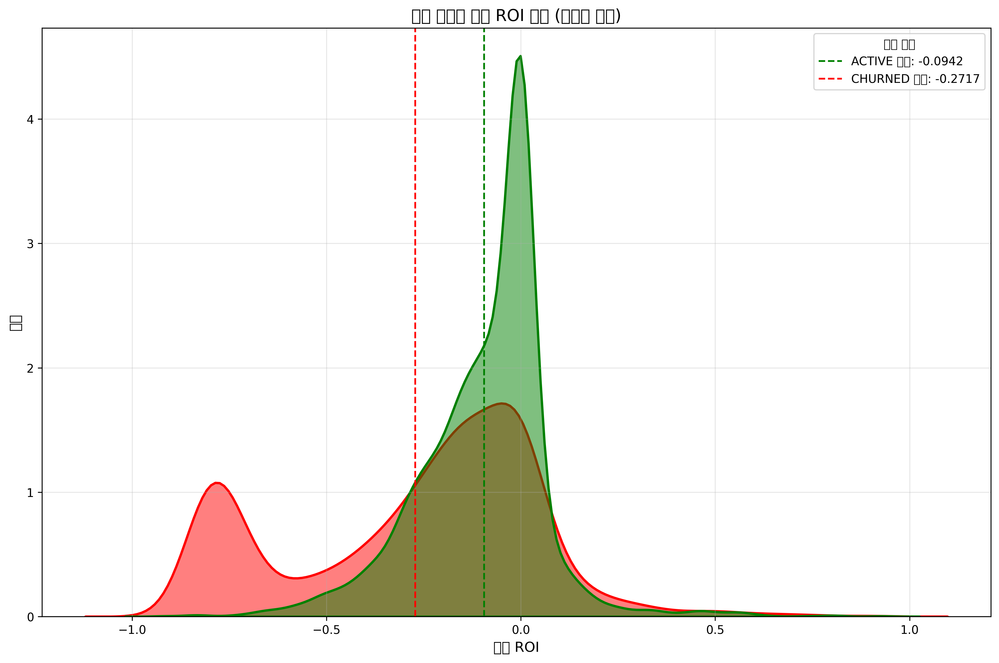

# Mann-Whitney U 검정 결과 요약

## 1. 검정 개요
- **분석 대상**: 밈코인 트레이딩 데이터
- **분석 목적**: 활성 지갑과 이탈 지갑 간의 기대 수익률(Expected ROI) 차이 검증
- **사용 검정 방법**: Mann-Whitney U 검정 (비모수적 방법)
- **데이터 전처리**: 이상치 제거 (IQR 방법 사용)

## 2. 데이터 특성
- **총 지갑 수**: 7,515개 (정제 후: 7,472개)
- **활성 지갑**: 2,998개 (40.12%)
- **이탈 지갑**: 4,474개 (59.88%)
- **이탈률**: 59.88%

## 3. 기술 통계
- **활성 지갑 ROI**:
  - 평균: -0.094198
  - 중앙값: -0.058403
  - 표준편차: 0.164637
- **이탈 지갑 ROI**:
  - 평균: -0.271741
  - 중앙값: -0.186972
  - 표준편차: 0.320481
- **평균 차이 (활성 - 이탈)**: 0.177542

## 4. Mann-Whitney U 검정 결과
- **U 통계량**: 8,967,731.0000
- **p-value**: 0.0000000000 (< 0.001)
- **귀무가설 결과**: 기각 (두 그룹의 분포가 통계적으로 유의미하게 다름)

## 5. 결론
- **통계적 유의성**: 활성 지갑과 이탈 지갑 간의 기대 수익률 분포는 통계적으로 매우 유의미한 차이를 보임 (p < 0.001)
- **실질적 의미**: 
  - 이탈 지갑은 활성 지갑보다 기대 수익률이 평균적으로 0.178 더 낮음
  - 이탈 지갑의 기대 수익률 변동성(표준편차)이 활성 지갑보다 약 2배 높음
  - 활성 지갑과 이탈 지갑 모두 평균 기대 수익률이 음수이나, 이탈 지갑에서 손실 정도가 더 큼

## 6. 시각화 해석

- **분포 형태**: 
  - 활성 지갑의 분포는 0에 더 가까운 영역에 집중됨
  - 이탈 지갑의 분포는 더 넓게 퍼져 있고 음수 영역에 더 집중됨
- **피크 위치**: 
  - 활성 지갑의 밀도 피크는 약 -0.06 부근에서 발생
  - 이탈 지갑의 밀도 피크는 약 -0.19 부근에서 발생
- **분포 변동성**: 이탈 지갑의 분포는 더 넓은 영역에 걸쳐 있어 수익률 변동성이 더 크다는 것을 시각적으로 확인 가능

## 7. 비즈니스 시사점
- **이탈 예측**: 기대 수익률은 지갑 이탈을 예측하는 유의미한 지표로 활용 가능
- **사용자 유지 전략**: 기대 수익률이 낮은 사용자 그룹에 대한 맞춤형 유지 전략 개발 필요
- **리스크 관리**: 이탈 지갑의 높은 수익률 변동성은 비일관적인 트레이딩 경험을 암시하며, 이는 이탈의 또 다른 요인일 수 있음

## 8. 한계점
- 상관관계가 인과관계를 의미하지는 않음 (기대 수익률 외 다른 요인도 이탈에 영향을 미칠 수 있음)
- 이상치 제거 방법에 따라 결과가 다소 달라질 수 있음
- 이분화된 지갑 상태(활성/이탈)는 더 복잡한 사용자 행동 패턴을 단순화할 수 있음

## 9. 추가 분석 제안
- 기대 수익률과 거래 활동(거래 횟수, 거래일수 등) 간의 복합적 관계 분석
- 시간에 따른 기대 수익률 변화와 이탈 확률 간의 관계 분석
- 다양한 기대 수익률 구간별 이탈률 분석을 통한 임계값 식별 